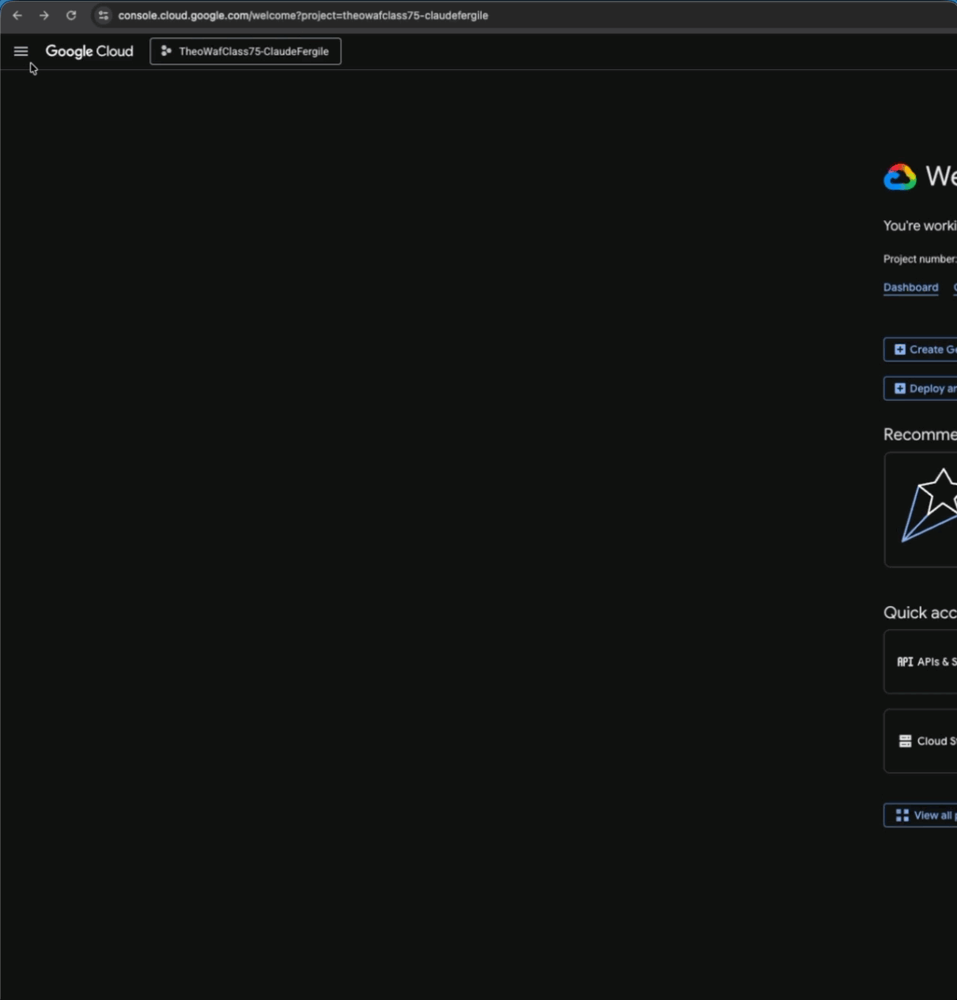
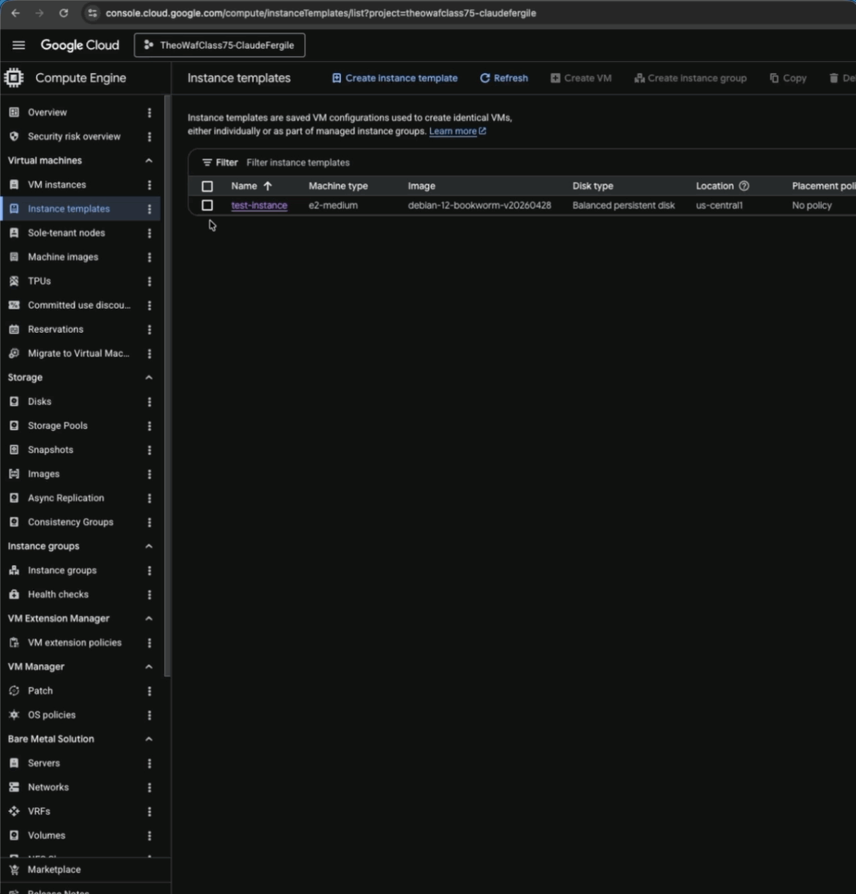
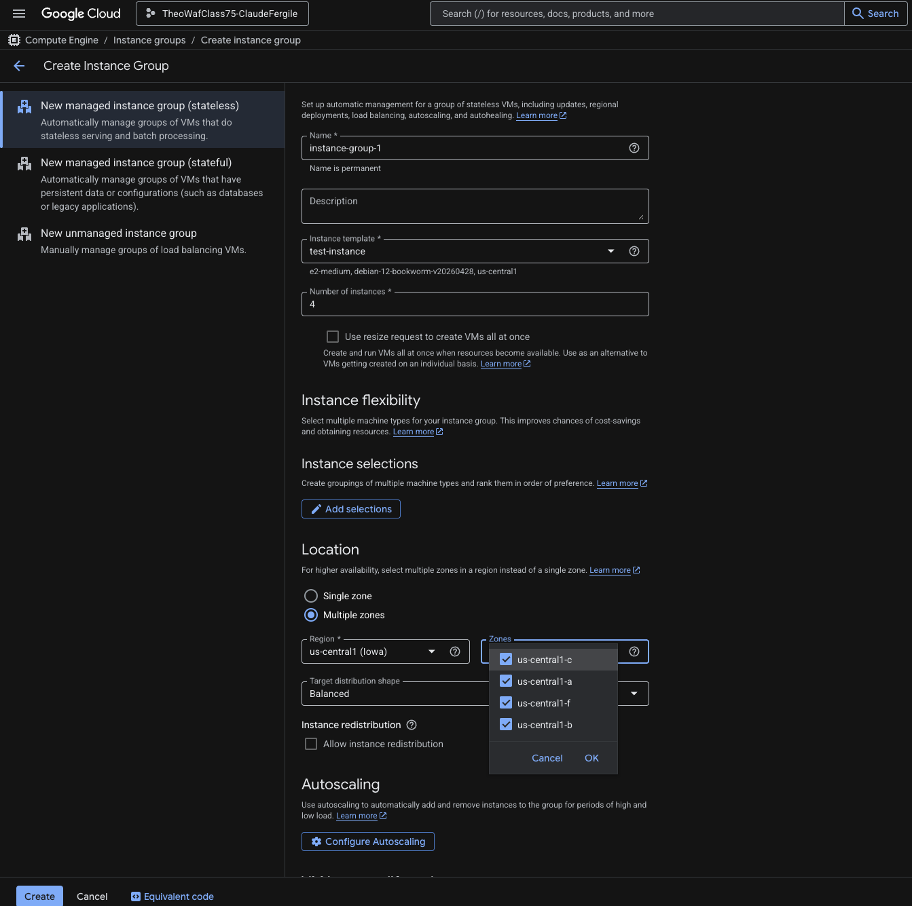
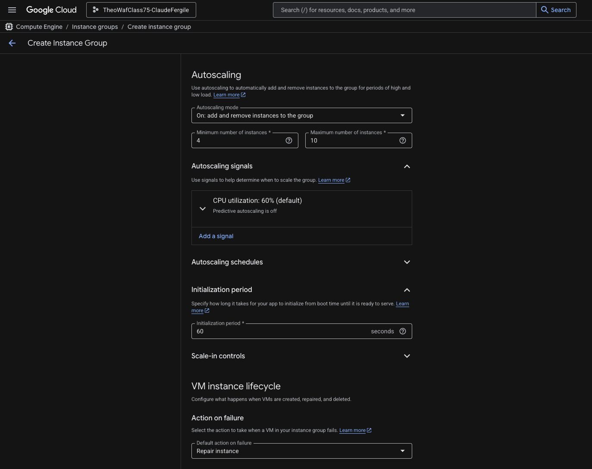
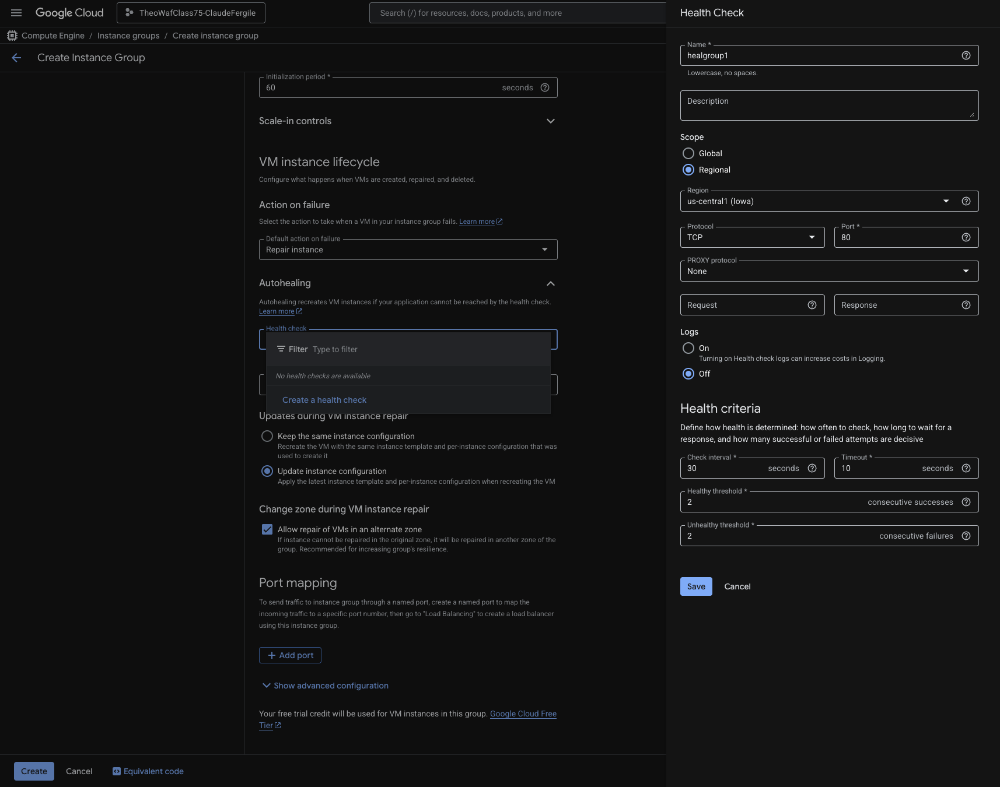
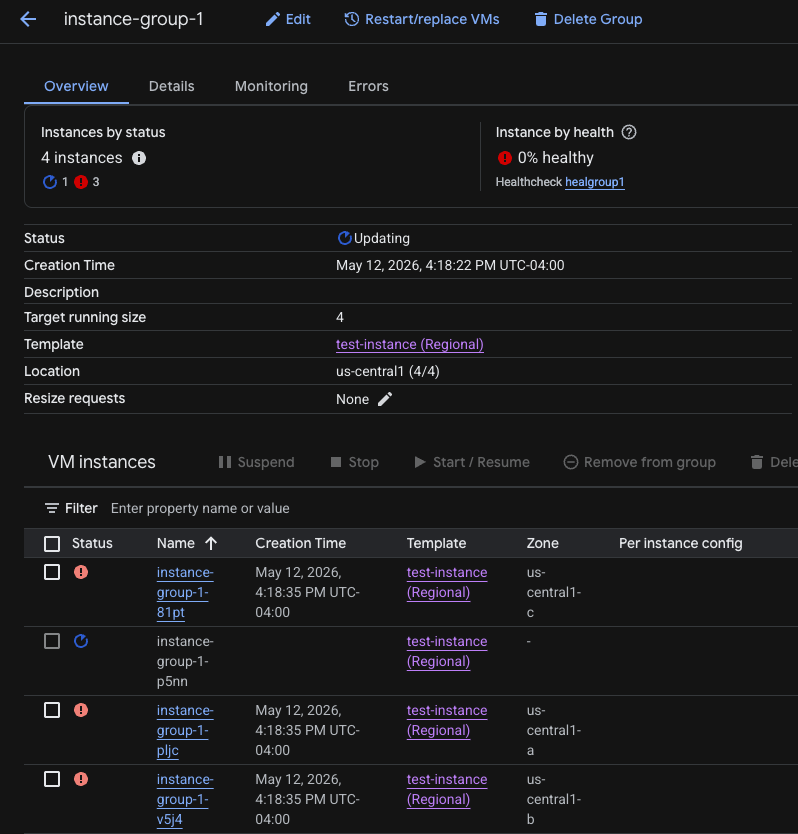
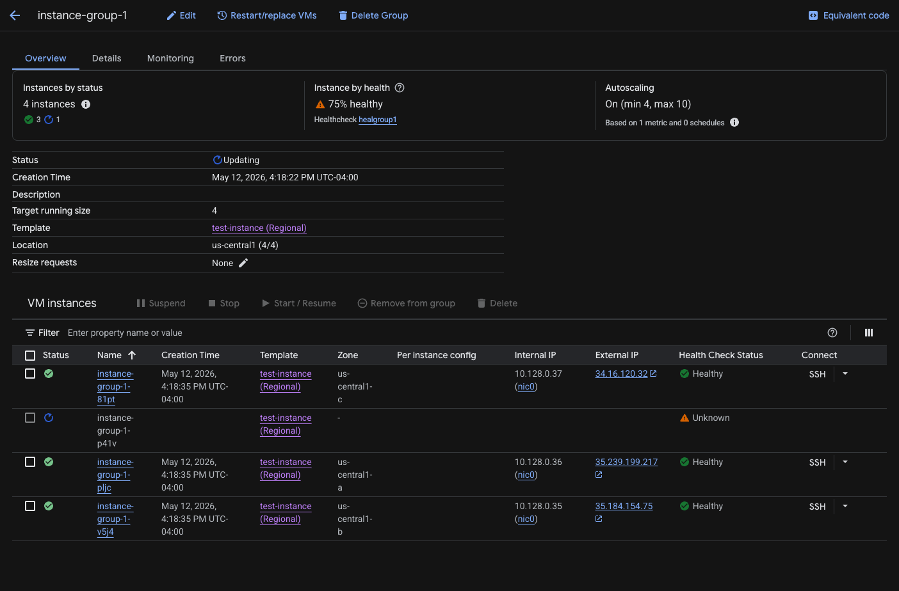
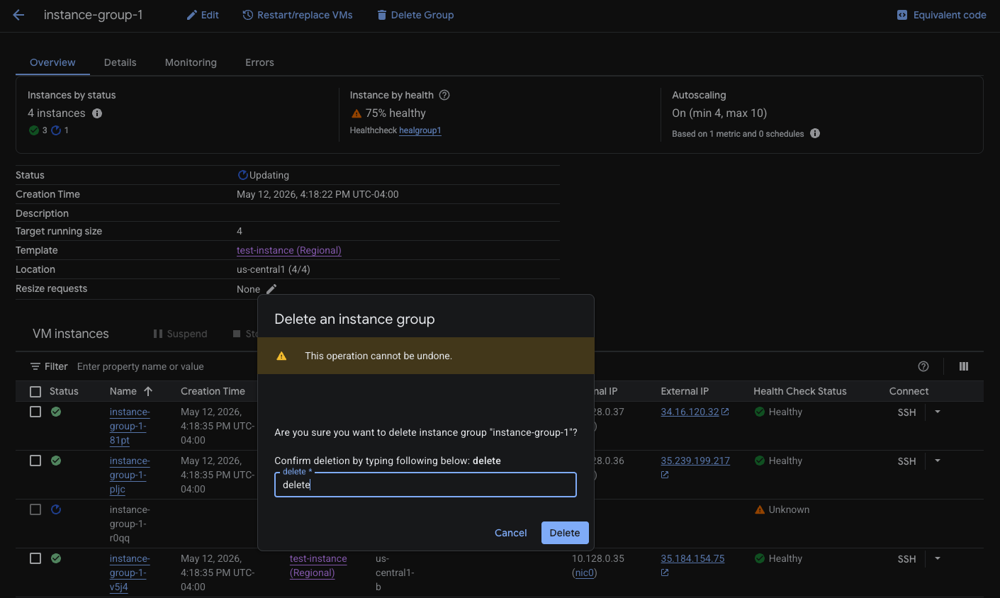
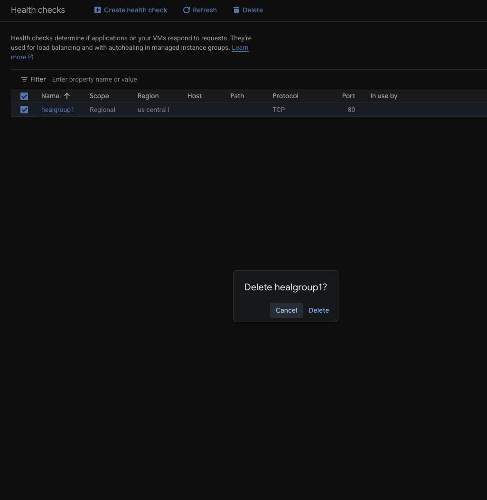

# Deploying a Managed Instance Group (MIG) Using the Console UI

The main objective of the following approach is to create a managed instance group. By creating a managed instance group you are able to efficiently and simutaneously deploy several instances at an instance(pun intended). With the configuration of an instance template we are able to deploy several instances with the same specs in a replicable manner.

# Prerequisites

1. Access to a Google Cloud Platform console.
2. A custom or default VPC in which your instances will operate in.
3. Firewall rule that allow your instances to be accessible.
4. An instance template which will serve as the blueprint for your MIG.
5. The enabling of your 'Compute Engine API'

# Deploying MIG

1. Log into GCP console.
2. Click on Hamburger menu in the top left corner. Once it drops down select "Compute Engine" then select "Instance Templates".

3. Check the box of the desired template and click "Create Instance Group" at the top of the screen.

4. Fill in the name of your instance/group, and ensure the correct template is selected.
5. Under "Number of Instances" for the sake of this deployment I will enter 4.
6. Under "Location" select "Multiple zones". Make sure the Region is set to the same region of your choosing. In my case it will be ser to Iowa.
7. Click on the zones drop down and ensure that all zones are selected. Doing this ensures availability.
 
8. Under "Autoscaling select the minimum number of instances to equal the number zones that the instances will be deployed to at the very least." The maximum we will leave at the default value of 10.
9. We will leave the other configurations as default.

10. Under "Autohealing" select the Health check dropdown and click "Create a health check".
11. Name the Health Check. select Regional under the scope section. Select the apporpriate region which should be uniform throughout. Set "Check interval" to 30 seconds, and "Timeout" to 10 seconds. Leave the remaining configuration as their default settings and click save.

12. Scroll to the bottom of the page leaving every other setting as default and click create.
13. Click on your instance group and monitor the instances being spun up. Be sure to give it some time and do not let the initial warning signs discourage you. Give the process a few minutes.

14. All VMs deployed successfully except one. The configuration is correct, but the target zone currently has exhausted resources. The MIG’s autohealing policy will continue retrying deployment until the resource becomes available.

# Decommission

1. Go into your MIG 
2. Select at the top of the page "Delete Group".

3. On the side panel right underneath Instance groups click on Health cheacks
4. Check the box of the health check most recently crated and at the top of the page click "Delete"

---