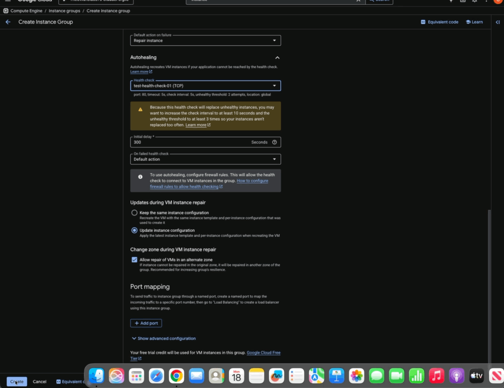
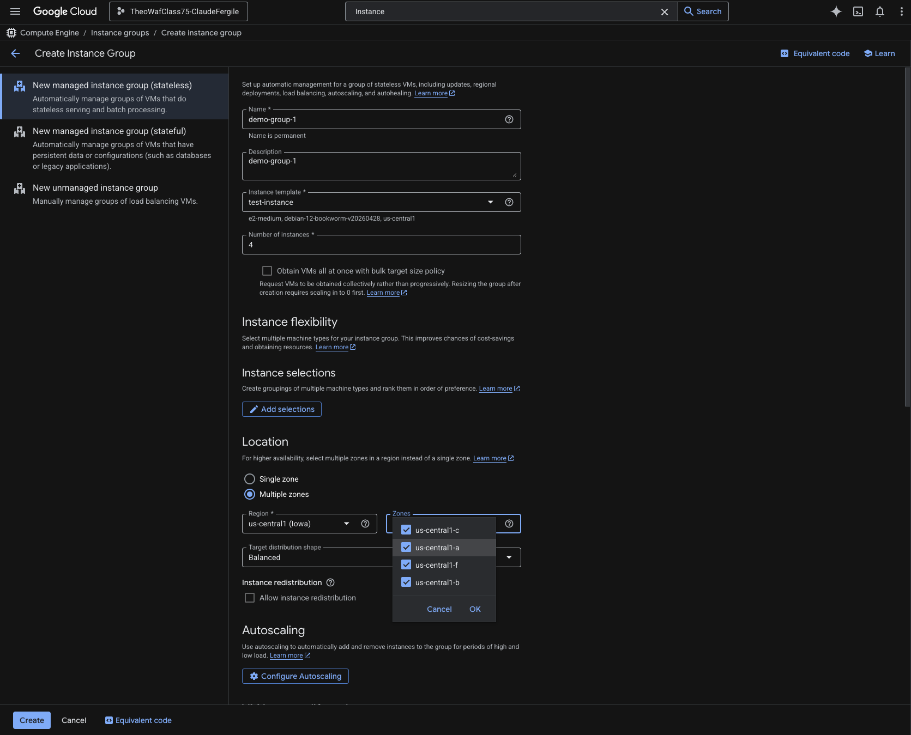
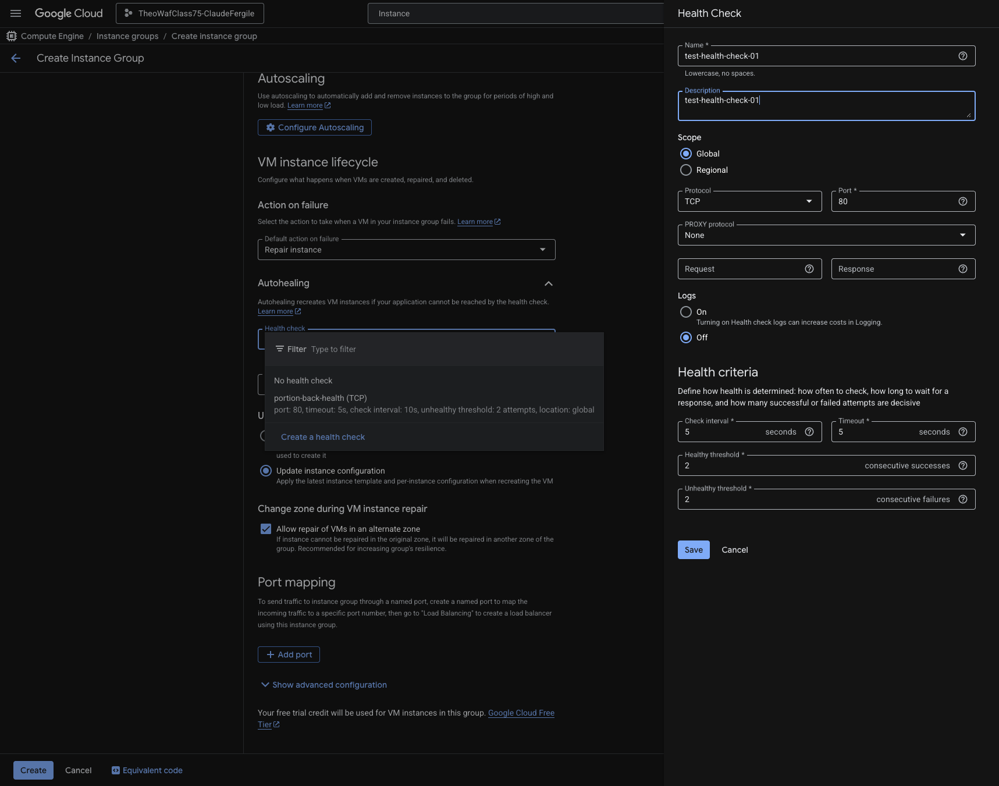
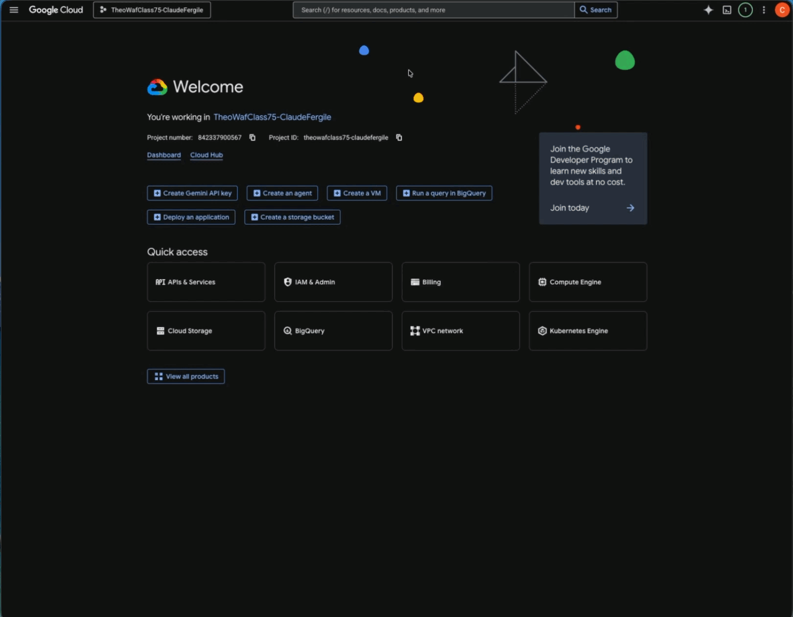
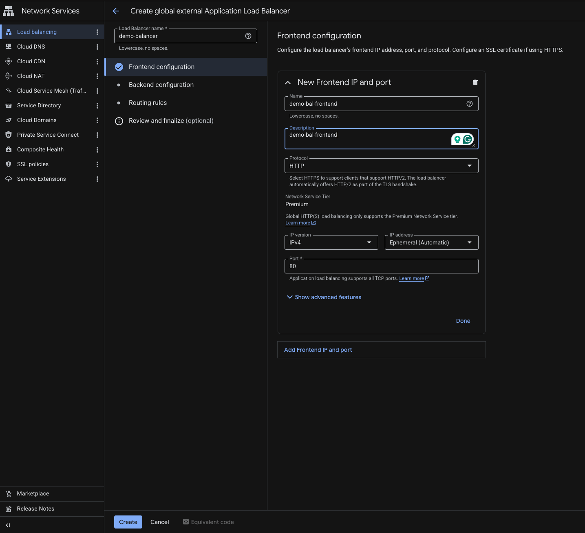
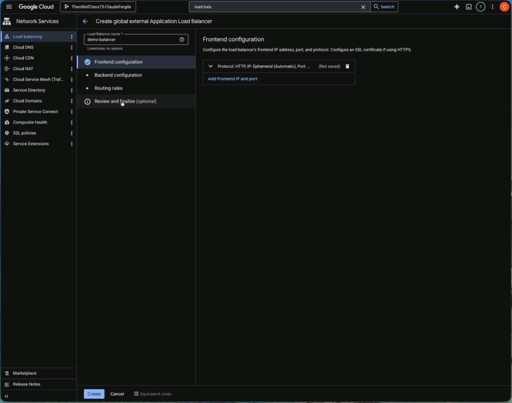
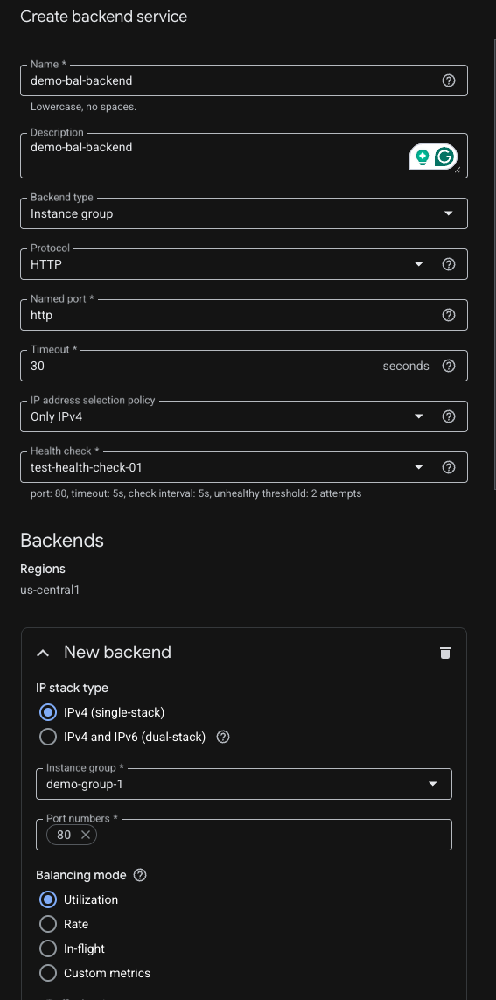
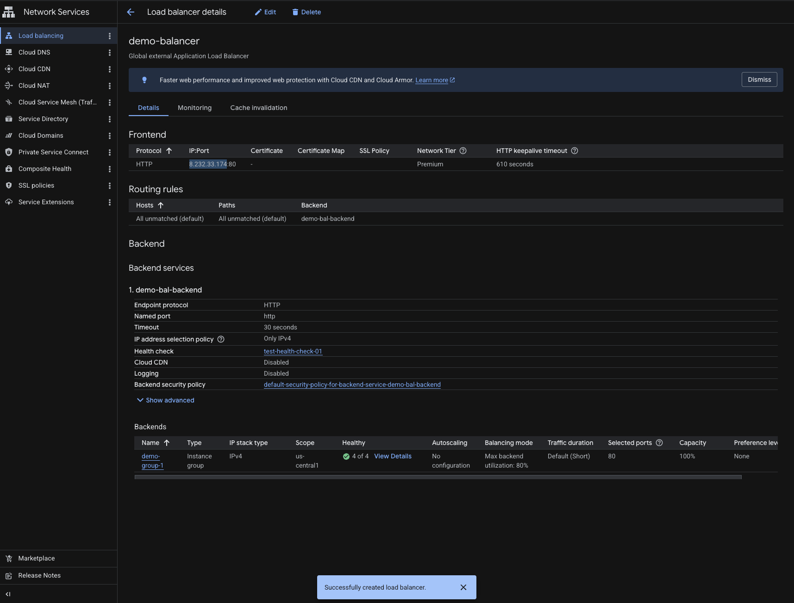
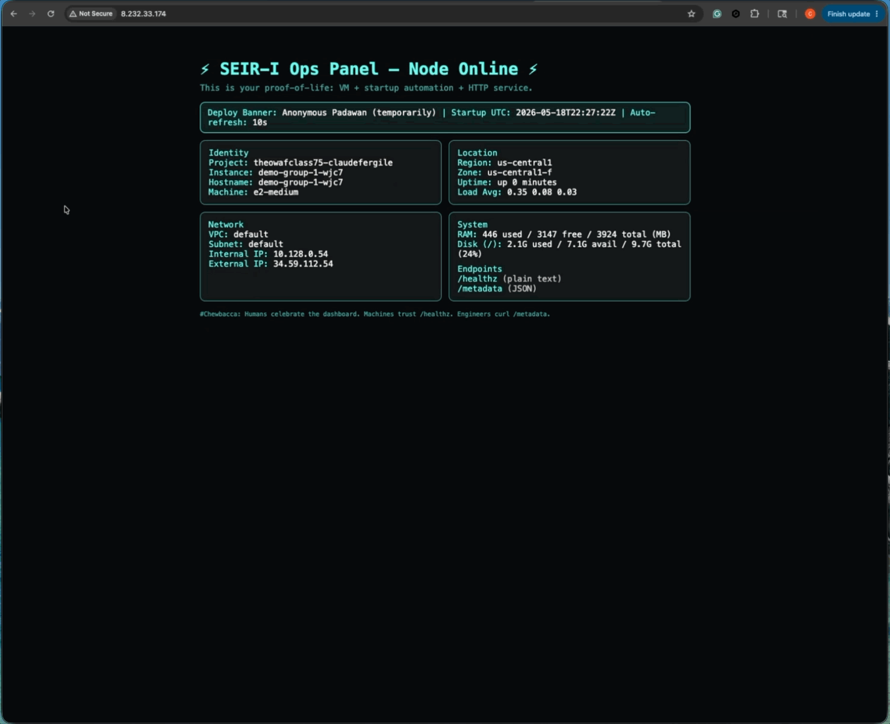
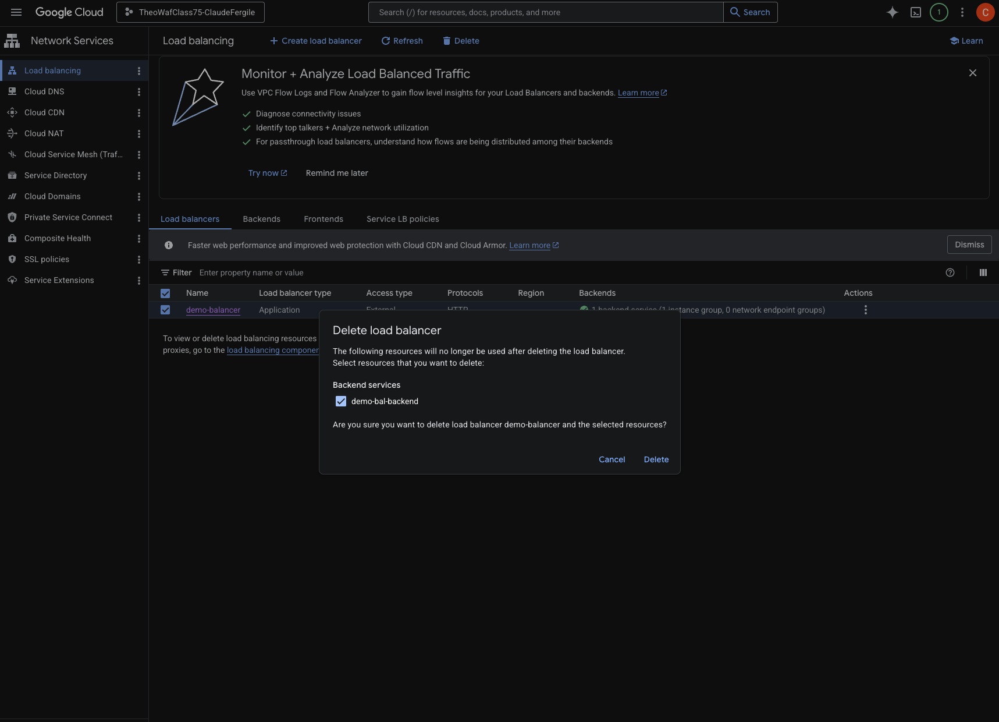

# Deploying an External Global Application Load Balancer with a MIG Backend via the Google Cloud Console

The main objective of the following approach is to deploy a fully configured external global Application Load Balancer using the Google Cloud Console (ClickOps), including configuring and connecting a Managed Instance Group (MIG) as the backend service.

## Prerequisite

1. Access to a Google Cloud Platform console.
2. A custom or default VPC in which your instances will operate in.
3. Firewall rule that allows your instances to be accessible.
4. An instance template with an automated startup script[(script used)]() that will serve as the blueprint for the MIG.
5. The Compute Engine API enabled

## Deploying MIG
1. Type "instance groups" in the search bar at the top page of the console and click on 'instance groups' when it populates.
2. Click on 'Create Instance Group'

3. Once the page loads, provide a name for your Managed Instance Group(MIG). You can also write a description of your choice.
4. Select an instance template and enter the number of instances you would like to create for your instance group.
5. Under 'Location" select the Multiple zones option.
6. Click the zones dropdown and make sure all boxes are ticked. That way we will have one instance in each zone.

7. Scroll down to the 'Autohealing' section and click on the health check dropdown.
8. Once the page loads name your health check in the corresponding box. (Again provide a description at your own discretion).
9. 'Logs' should be se to "on".
10. Leave all other settings as default and click save.

11. At this point you can click on "Create" and wait for your MIG to spin up.

---

## Deploying Load Balancer

1. Type "load balancing" in the search bar at the top page of the console and click on 'load balancing' when it populates.
2. Click on 'Create load balancer'.

3. On the following page click 'Next', keeping the 'Application Load Balancer (HTTP/HTTPS)' as our selected option.
4. Click 'Next' again under the 'Public facing or internal' section, keeping 'Public facing(external)' as our selected option.
5. Click 'Next' again under the 'Global or single region deployment' section, keeping 'Best for global workloads' as our selected option.
6. Click 'Next' again under the 'Load balancer generation' section keeping 'Global external Application Load Balancer' as our selected option.
7. Finally click 'Configure' under the 'Create load balancer' section which essentially summarizes the options we have selected thus far.
8. Once the next page loads provide the load balancer a name in the box that prompts "Load Balancer Name".
9. Next under the 'New Frontend IP and port' section provide a name for your frontend. (Provide a description at your discretion). Leave all other configurations as default and click 'Done'.

10. Click on 'Backend configuration'.
11. Click on the 'Backend services & backend buckets' drop down. Then click on the 'Create a backend service' option.

13. Provide a name for your backend(Provide a description at your discretion).
14. Under the 'Health check' dropdown you can select the Health check that we crated earlier during our MIG configuration.
15. Scroll down to the 'New backend section' and click on the 'Instance group' drop down menu. Select the MIG that was made earlier.
16. Right under is the prompt 'Port numbers'. Type in "80".

17. Scroll down to the 'Cloud CDN' section and disable untick the 'Enable Cloud CDN' box.
18. Leave all other configurations as default and click 'Create'.

19. Click 'Ok' and navigate to the 'Routing rules' tab. Nothing needs to be configured on this page since we have one backend. 'Simple host and path rule' will remain as our default setting.
20. Click on review and finalize to see an overview of the configurations that have been made so far and select 'Create'. Wait for the Load Balancer to load.
21. Click on the Load Balancer and scroll down to the Frontend section. Copy the first four octets under IP:Port and paste it in your web browsers address bar succeding "http://".

22. Refresh to ensure that both your internal and external IP's are changing.

---

## Decommission

### 1. Delete the Load Balancer

Go to:

Navigation Menu → Network Services → Load balancing

Then:

- Click the load balancer you created.
- Click 'Delete'.
- Tick the box to delete backend as well.
- Confirm deletion.

### 2. Delete the Managed Instance Group (MIG)

Go to:

Compute Engine → Instance groups

- Select the MIG.
- Click Delete.

### 3. Delete the Health Check(s)

Go to:

Network Services → Health checks

Delete:

- Load balancer health checks
- MIG autohealing health checks (if separate)

