# Debugging Faulty VM and Infra

## Initial State

### Before making any changes, I want to document the initial state of the VM to establish a baseline and better understand the scope of the issue.

VM name: homework-vm

Zone/region: us-central1-a

External IP: None

Expected behavior: The VM should be accessible as a web server on the public internet and SSH should work.

Actual behavior: The VM is stopped.

Initial observations:

* No external IP assigned
* VM is not running
* Public web access unavailable
* SSH access unavailable

### Since the VM is not running, I will start it and monitor how it behaves.

Compute Engine → VM Instances → Start

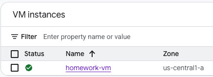

## Findings

### First thing I noticed was that the VM was stopped.

A stopped VM cannot serve web traffic or accept SSH connections, so this would explain why the VM was inaccessible.

### Next I will attempt to SSH into the VM.

From the VM Instances page, click SSH to initiate an SSH connection.

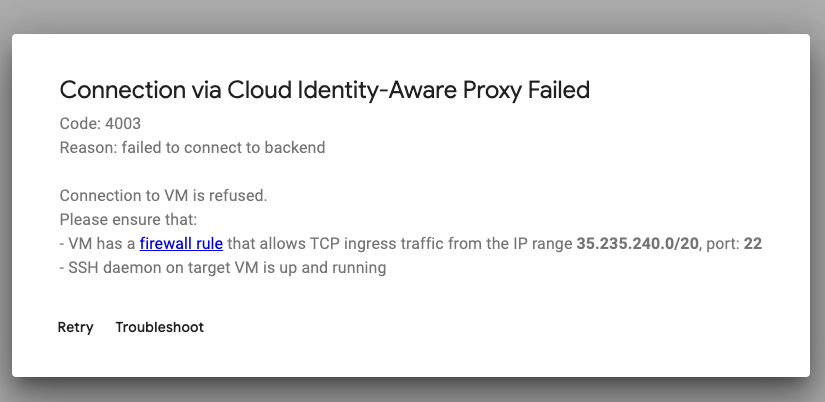

### Findings

The SSH connection still fails even after starting the VM.

I also noticed that an External IP was not assigned to the VM.

Under the External IP column on the VM Instances page, the value is still empty.

### Next I will inspect the firewall rules.

Navigate to:

VPC Network → Firewall

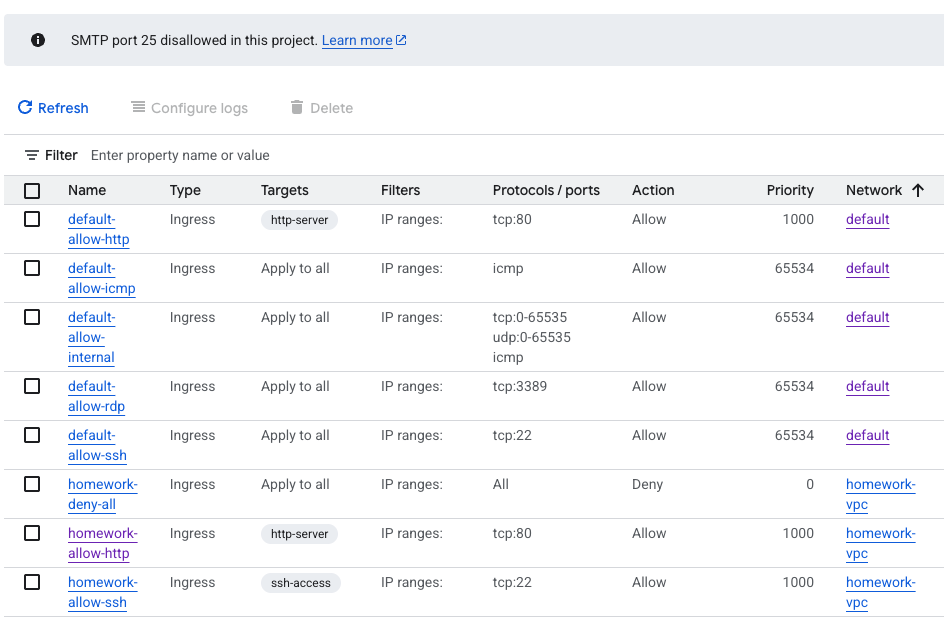

We can see that firewall rules exist for both TCP port 22 (SSH) and TCP port 80 (HTTP). However, if we look at the priority values, we can see that `homework-deny-all` has a priority of `0` while both `homework-allow-http` and `homework-allow-ssh` have a priority of `1000`.

In GCP, lower numbers have higher priority. Because of this, the deny rule is evaluated before either allow rule, meaning all traffic will be denied regardless of the allow rules being present.

### Lets correct the firewall rule priorities and test again.

Click on the `homework-deny-all` rule and change the priority value to `1`.

Do the same for `homework-allow-http` and `homework-allow-ssh`, but set both of them to `0`.

This should allow HTTP and SSH traffic before the deny-all rule is evaluated.

### Lets test SSH again.

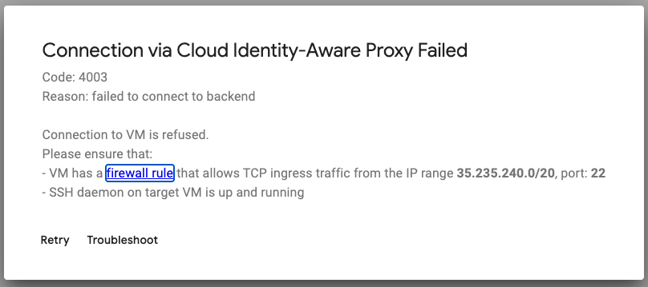

### Findings

The SSH connection still fails after correcting the firewall rule priorities.

### Conclusion

The firewall rule priorities were definitely misconfigured and would have prevented both SSH and HTTP traffic from reaching the VM. However, correcting the priorities did not resolve the issue, which tells us there is at least one additional problem that still needs to be investigated.

### Assessment

The SSH connection still fails after correcting the firewall rule priorities.

Error:

Connection to VM is refused.

Please ensure that:

* VM has a firewall rule that allows TCP ingress traffic from the IP range 35.235.240.0/20 on port 22
* SSH daemon on the target VM is running

This suggests that the issue may be related to the source IP ranges configured in the firewall rule. The error specifically references the IP range `35.235.240.0/20`, so my next step will be to inspect the SSH firewall rule and verify that this range is allowed.

### Lets check the IP range.

Go to the SSH firewall rule and take note of the range.

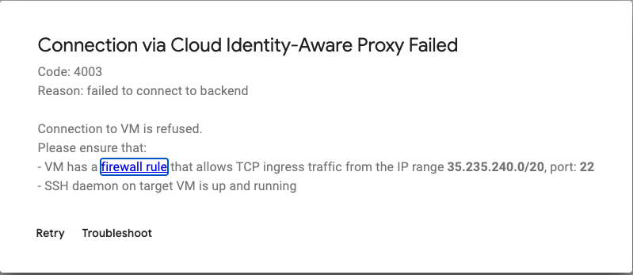

### Observations

We can see that the source IP range is currently configured as `1.2.3.4/32`.

Considering the warning from the failed SSH attempt, this immediately stands out as suspicious. The error indicates that SSH traffic should be allowed from the IP range `35.235.240.0/20`, however the firewall rule is only allowing a single IP address.

Since `/32` represents a single IP address, it is possible that legitimate SSH traffic is being blocked before it ever reaches the VM.

### Lets provide a more permissive IP range.

To determine whether the source IP range is the issue, I will temporarily change the source range to `0.0.0.0/0`.

This will allow traffic from any IP address and help rule out the firewall rule as the cause of the failed SSH connection.

If SSH begins working after this change, it would strongly suggest that the original source IP range was misconfigured.

### Findings

SSH was successful.

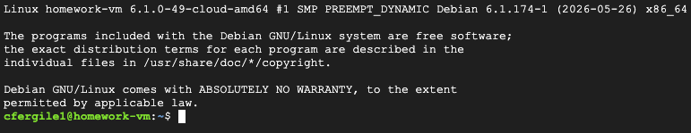

At this point it appears that the source IP range and firewall rule priorities were contributing factors to the failed SSH connection.

### Lets address the nonexistent External IP address.

The VM still does not have an External IP address assigned, so the next step is to review the VM's network configuration.

Navigate to the VM, select the VM, and click **Edit**.

Scroll down to the network section.

### Observations

In the network interface section, the External IPv4 address is set to `None`.

### Lets provide an IPv4 address.

Click the drop down for **External IPv4 address** and choose the **Ephemeral** option.

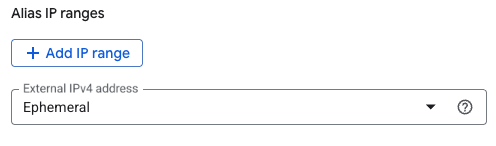

### Lets ensure the firewall rules are attached to the VM.

There are no firewall options selected, however there is a network tag for `ssh-access`. Since the VM is expected to serve web traffic, I also need to verify that the HTTP firewall rule is associated with the instance.

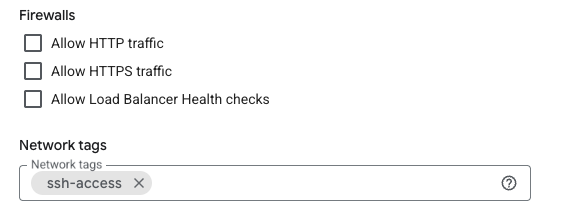

### Lets inspect the `homework-allow-http` firewall rule.

It appears the `homework-allow-http` firewall rule has a target tag, however the VM does not have it attached.

### Lets assign the tag to our VM.

Copy and paste the HTTP target tag.

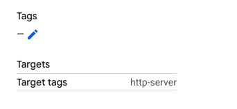

Make sure to avoid any empty white spaces when copying.

Navigate back to the VM settings page.

In the Network tags section, paste the tag into the appropriate field.

After saving, the VM should now be associated with the HTTP firewall rule.

### Now lets test our HTTP connection.

Copy and paste the External IP address.

Paste it into a browser and make sure to place `http://` before the IP address.

### Findings

The web page still times out even after assigning an External IP address and adding the HTTP network tag.

Error:

```text
This site can't be reached
35.222.140.206 took too long to respond.
ERR_CONNECTION_TIMED_OUT
```

### Assessment

At this point the VM has an External IP address, the HTTP firewall rule exists, and the VM has the appropriate network tag assigned.

Since the connection is timing out rather than being refused, there is likely another networking issue preventing traffic from reaching the VM.

My next step is to determine whether the problem is the web server itself or something in the network path.

### Lets verify that Apache is running.

SSH into the VM and run:

```bash
sudo ss -tulpn | grep :80
```

### Findings

Output confirms that Apache is actively listening on port 80.

### Assessment

Since Apache is listening on port 80, the web server is running correctly. This allows me to rule out Apache as the primary cause of the timeout.

### Lets test connectivity from inside the VM.

Run:

```bash
curl localhost
```

### Findings

The request succeeds and returns the expected page.

### Assessment

Apache is serving content locally, which further confirms that the web server itself is functioning correctly.

The issue appears to be somewhere in the network path rather than with the application running on the VM.

### Lets test outbound connectivity.

Run:

```bash
curl ifconfig.me
```

and

```bash
ping 8.8.8.8
```

### Findings

Both tests fail.

```text
curl: (28) Failed to connect
```

```text
100% packet loss
```

### Assessment

This is a significant finding because these tests do not rely on the local web server.

The VM is unable to communicate with external networks, which suggests a broader networking issue rather than a problem with Apache, firewall tags, or the External IP address.

### Additional Troubleshooting Performed

To rule out operating system level firewalls, I checked the following:

```bash
sudo ufw status
```

Result:

```text
ufw: command not found
```

I then checked iptables:

```bash
sudo iptables -L -n
```

Result:

```text
Chain INPUT (policy ACCEPT)
Chain FORWARD (policy ACCEPT)
Chain OUTPUT (policy ACCEPT)
```

### Assessment

The VM itself is not blocking inbound or outbound traffic.

This shifts the investigation away from the operating system and back toward the VPC networking configuration.

### Lets inspect the VPC routes.

Navigate to:

```text
VPC Network → Routes
```

While reviewing the routes associated with `homework-vpc`, I found that only the local subnet route existed.

A default route did exist, but it belonged to the `default` VPC rather than `homework-vpc`.

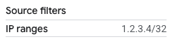

### Assessment

Without a default route, instances inside `homework-vpc` can communicate with resources on the local subnet but have no path to the public Internet.

This explains why:

* `ping 8.8.8.8` failed
* `curl ifconfig.me` failed
* HTTP requests to the VM timed out despite Apache running correctly

### Resolution

Create a new route with the following settings:

```text
Name: homework-default-route
Network: homework-vpc
Destination IP range: 0.0.0.0/0
Priority: 1000
Next hop: Default internet gateway
```


### Validation

After creating the route, I repeated the previous connectivity tests.

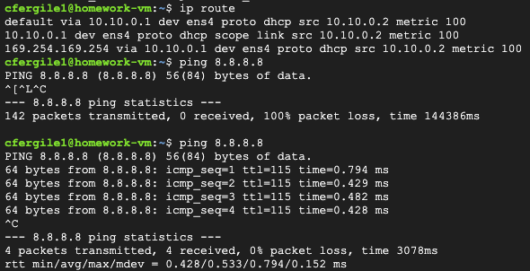

### Findings

Prior to creating the route, `ping 8.8.8.8` resulted in 100% packet loss.

After creating the route, the same test completed successfully and returned responses from Google's public DNS server.

This confirmed that outbound connectivity had been restored.

I then navigated to the VM's External IP address in a browser.


The application loaded successfully and displayed the expected response.

Finally, I verified the application directly from the VM.

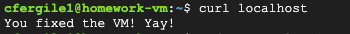

The request returned:

```text
You fixed the VM! Yay!
```

This confirmed that the VM was functioning as expected and that all required connectivity and application issues had been resolved.

## Root Cause

Multiple configuration issues were present:

1. The VM was stopped.
2. Firewall rule priorities were misconfigured.
3. The SSH firewall rule was restricted to an invalid source range.
4. The VM did not have an External IP address assigned.
5. The VM was missing the HTTP network tag.
6. The `homework-vpc` network did not have a default route (`0.0.0.0/0`) to the Internet gateway.

The missing default route was the final issue identified during troubleshooting and the last blocker preventing Internet connectivity and public web access.

## Lessons Learned

This troubleshooting exercise reinforced the importance of validating assumptions and testing one layer at a time.

Several issues were discovered during the investigation, and while some appeared to be the root cause at first glance, additional testing revealed that multiple independent problems existed simultaneously.

Had troubleshooting stopped after fixing the firewall priorities or SSH source range, the VM still would not have been fully functional. The same was true after assigning an External IP address and attaching the HTTP firewall tag.

Verifying each layer individually, including VM state, firewall rules, source ranges, network tags, application health, outbound connectivity, and routing configuration, ultimately led to the successful resolution of the issue.

The biggest takeaway from this exercise is that complex outages often have more than one contributing factor. A structured troubleshooting process helps ensure that secondary issues are not overlooked once the first problem is identified.
