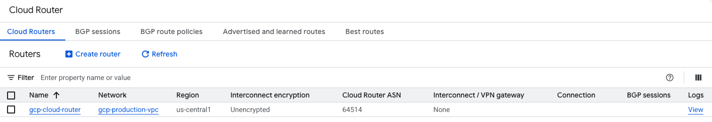
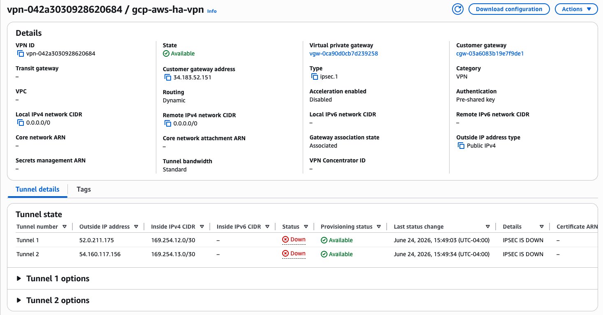
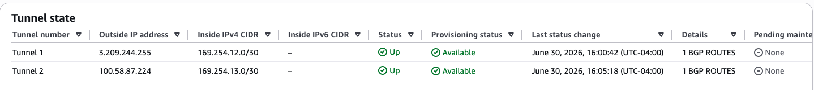
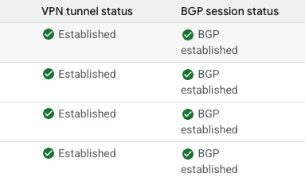
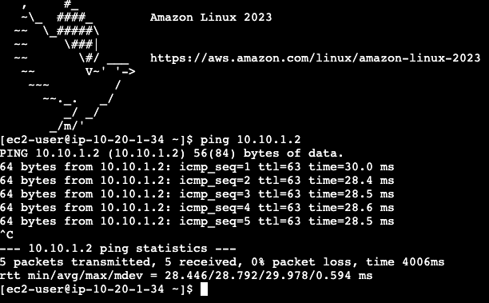

# Hybrid Cloud VPN Deployment Guide

## Google Cloud HA VPN ↔ AWS Site-to-Site VPN

### Design, Deployment, Validation, and Cleanup

A production-style hybrid cloud networking project demonstrating secure connectivity between **Google Cloud Platform (GCP)** and **Amazon Web Services (AWS)** using **Google Cloud HA VPN**, **AWS Site-to-Site VPN**, **IPsec**, and **Border Gateway Protocol (BGP)**.

The project establishes a highly available VPN architecture consisting of four redundant IPsec tunnels, dynamically exchanges routes between cloud providers using BGP, and validates secure private communication between workloads hosted in separate cloud environments.

---

# Project Overview

The objective of this project is to design, deploy, validate, troubleshoot, and safely decommission a hybrid cloud network connecting Google Cloud and AWS using industry-standard networking technologies.

The deployment includes:

- Custom VPCs in both cloud providers
- Google Cloud HA VPN
- AWS Site-to-Site VPN
- Google Cloud Cloud Router
- AWS Virtual Private Gateway
- Two AWS Customer Gateways
- Four redundant IPsec VPN tunnels
- Dynamic routing using Border Gateway Protocol (BGP)
- End-to-end validation over private IP addresses

This repository contains the complete deployment documentation, validation procedures, troubleshooting guidance, and cleanup instructions required to reproduce the environment.

---

# Architecture

```text
                        Hybrid Cloud Architecture

        Google Cloud Platform (GCP)                 Amazon Web Services (AWS)
┌─────────────────────────────────────┐     ┌─────────────────────────────────────┐
│        gcp-production-vpc           │     │        aws-production-vpc           │
│          10.10.1.0/24               │     │          10.20.0.0/16               │
│                                     │     │                                     │
│         gcp-test-vm                 │     │         aws-test-ec2                │
│         10.10.1.2                   │     │         10.20.1.34                  │
│                                     │     │                                     │
│     Cloud Router (ASN 64514)        │◄──►│ Virtual Private Gateway (ASN 65001) │
│                                     │     │                                     │
│     HA VPN Gateway (2 Interfaces)   │═════│ Four IPsec VPN Tunnels              │
└─────────────────────────────────────┘     └─────────────────────────────────────┘
```

---

# Technologies Used

## Google Cloud

- Virtual Private Cloud (VPC)
- Compute Engine
- Cloud Router
- HA VPN
- Firewall Rules

## Amazon Web Services

- Virtual Private Cloud (VPC)
- EC2
- Virtual Private Gateway
- Customer Gateway
- Site-to-Site VPN
- Security Groups
- Route Tables

## Networking

- IPsec
- IKEv2
- Border Gateway Protocol (BGP)
- Dynamic Routing
- CIDR
- ICMP
- Route Propagation

---

# Skills Demonstrated

This project demonstrates practical experience with:

- Hybrid cloud networking
- High availability VPN design
- Google Cloud networking
- AWS networking
- IPsec VPN configuration
- Border Gateway Protocol (BGP)
- Dynamic route exchange
- Route propagation
- Cloud infrastructure troubleshooting
- Network validation
- Technical documentation
- Dependency-aware resource cleanup

---

# Deployment Highlights

The deployment included the following infrastructure:

- Custom Google Cloud VPC
- Custom AWS VPC
- Google Cloud HA VPN Gateway
- AWS Virtual Private Gateway
- Two AWS Customer Gateways
- Two AWS Site-to-Site VPN Connections
- Four Google Cloud VPN Tunnels
- Four BGP Sessions
- Dynamic Route Exchange
- End-to-End Private Connectivity Validation

---

# Validation Results

The completed deployment achieved the following validated state:

- Four IPsec tunnels established
- Four BGP sessions established
- Google Cloud learned the AWS network (`10.20.0.0/16`)
- AWS installed the Google Cloud network (`10.10.1.0/24`) through route propagation
- Google Cloud VM successfully communicated with the AWS EC2 instance
- AWS EC2 successfully communicated with the Google Cloud VM
- End-to-end communication occurred entirely over private IP addresses

---

# Repository Structure

```text
14-Week14/
│
├── README.md
│
├── documentation/
│   ├── runbook.md
│   └── Q & A.md
│
└── images/
    ├── 01-gcp-vpc-created.png
    ├── 02-gcp-test-vm-created.png
    ├── 03-gcp-cloud-router-created.png
    ├── ...
    └── 18-end-to-end-ping-validation.png
```

---

# Documentation

| Document | Description |
|----------|-------------|
| `documentation/runbook.md` | Complete deployment guide covering planning, implementation, validation, troubleshooting, and cleanup |
| `documentation/Q & A.md` | Technical questions, explanations, and supporting concepts related to the deployment |

---

# Deployment Screenshots

## Google Cloud Infrastructure




---

## VPN Deployment





---

## Validation





---

# Key Lessons Learned

This deployment reinforced several important networking concepts:

- IPsec and BGP serve different purposes within a VPN architecture.
- Google Cloud HA VPN exposes two gateway interfaces, while AWS creates four tunnel endpoints across two Site-to-Site VPN connections.
- Correct BGP peer IP addressing is critical for successful route establishment.
- AWS requires Virtual Private Gateway route propagation before learned routes become active within the VPC route table.
- Validating a hybrid cloud deployment layer by layer significantly simplifies troubleshooting.
- Careful planning of IP addressing, ASNs, and tunnel mappings reduces deployment complexity and prevents configuration errors.

---

# References

## Google Cloud

- HA VPN  
  https://cloud.google.com/network-connectivity/docs/vpn/concepts/overview

- Cloud Router Overview  
  https://cloud.google.com/network-connectivity/docs/router/concepts/overview

- External Peer VPN Gateway  
  https://cloud.google.com/network-connectivity/docs/vpn/how-to/creating-ha-vpn2

---

## Amazon Web Services

- AWS Site-to-Site VPN  
  https://docs.aws.amazon.com/vpn/latest/s2svpn/

- AWS Virtual Private Gateway  
  https://docs.aws.amazon.com/vpn/latest/s2svpn/VPC_VPN.html

- AWS Customer Gateway  
  https://docs.aws.amazon.com/vpn/latest/s2svpn/your-cgw.html

- AWS Route Tables and Route Propagation  
  https://docs.aws.amazon.com/vpc/latest/userguide/RouteTables.html

---

## RFCs

- RFC 4301 – Security Architecture for the Internet Protocol  
  https://www.rfc-editor.org/rfc/rfc4301

- RFC 4303 – IP Encapsulating Security Payload (ESP)  
  https://www.rfc-editor.org/rfc/rfc4303

- RFC 7296 – Internet Key Exchange Protocol Version 2 (IKEv2)  
  https://www.rfc-editor.org/rfc/rfc7296

- RFC 4271 – Border Gateway Protocol Version 4 (BGP-4)  
  https://www.rfc-editor.org/rfc/rfc4271