# Hybrid Cloud VPN Deployment Guide

## Google Cloud HA VPN ↔ AWS Site-to-Site VPN

### Design, Deployment, Validation, and Cleanup

> **Project:** Hybrid Cloud Connectivity Between Google Cloud Platform (GCP) and Amazon Web Services (AWS) using IPsec and BGP  
> **Deployment Model:** High Availability (HA) VPN with Dynamic Routing (BGP)  
> **Repository:** `14-Week14`  
> **Runbook:** `documentation/runbook.md`  
> **Images:** `../images/`

---

# Table of Contents

1. Introduction
2. Project Overview
3. Objectives
4. Prerequisites
5. Estimated Deployment Time
6. Final Architecture
7. Deployment Resource Inventory
8. Phase I – Planning
9. Phase II – Google Cloud Infrastructure
10. Phase III – AWS Infrastructure
11. Phase IV – VPN Construction
12. Phase V – BGP and Dynamic Routing
13. Phase VI – Validation
14. Phase VII – Cleanup and Cost Management
15. Lessons Learned
16. Troubleshooting Guide
17. Interview Talking Points

---

# Introduction

This runbook documents the deployment, validation, troubleshooting, and cleanup of a production-style hybrid cloud network connecting **Google Cloud Platform (GCP)** and **Amazon Web Services (AWS)**.

The environment uses **Google Cloud HA VPN**, **AWS Site-to-Site VPN**, **IPsec encryption**, and **Border Gateway Protocol (BGP)** to establish secure, dynamically routed communication between two independent cloud providers.

Unlike a theoretical walkthrough, every procedure in this guide reflects a deployment that was successfully built, validated, troubleshot, and verified end to end. The configuration documented throughout this runbook represents the final working deployment and incorporates lessons learned during implementation.

---

# Project Overview

This project demonstrates how to build a secure, highly available hybrid cloud network that allows workloads in Google Cloud and AWS to communicate using private IP addresses.

The deployment consists of:

- A custom Virtual Private Cloud (VPC) in Google Cloud
- A custom Virtual Private Cloud (VPC) in AWS
- A Google Cloud HA VPN Gateway
- An AWS Virtual Private Gateway
- Two AWS Site-to-Site VPN connections
- Four redundant IPsec VPN tunnels
- Dynamic route exchange using BGP
- End-to-end connectivity validation between a Google Cloud VM and an AWS EC2 instance

The final validation confirms that both cloud environments can securely exchange traffic over private IP space without relying on the public internet for application communication.

---

# Objectives

By completing this deployment, you will:

- Design a hybrid cloud network spanning Google Cloud and AWS.
- Deploy custom VPCs and subnets in both cloud providers.
- Configure Google Cloud HA VPN and AWS Site-to-Site VPN.
- Establish four redundant IPsec VPN tunnels.
- Configure dynamic routing using BGP.
- Validate learned routes in both cloud environments.
- Verify private IP connectivity between Google Cloud and AWS.
- Learn a structured troubleshooting methodology for hybrid cloud networking.
- Perform a dependency-aware cleanup of all deployed resources.

---

# Prerequisites

Before beginning this deployment, ensure you have:

- An active Google Cloud project.
- An active AWS account.
- IAM permissions to create networking resources in both environments.
- SSH access configured for Google Cloud Compute Engine and AWS EC2.
- Basic familiarity with IP networking concepts, including CIDR notation, routing, IPsec, and BGP.
- A terminal capable of SSH and ICMP testing.

---

# Estimated Deployment Time

| Phase | Estimated Time |
|--------|----------------|
| Planning | 15–20 minutes |
| Google Cloud Infrastructure | 30–45 minutes |
| AWS Infrastructure | 30–45 minutes |
| VPN Construction | 30–45 minutes |
| BGP Configuration | 20–30 minutes |
| Validation | 15–30 minutes |
| Cleanup | 15–20 minutes |

**Estimated Total:** Approximately **3 to 4 hours** for a first-time deployment.

---

# Final Architecture

```text
                           Hybrid Cloud Architecture

        Google Cloud Platform (GCP)                     Amazon Web Services (AWS)
┌──────────────────────────────────────┐      ┌──────────────────────────────────────┐
│            gcp-production-vpc        │      │          aws-production-vpc          │
│             10.10.1.0/24             │      │            10.20.0.0/16              │
│                                      │      │                                      │
│          gcp-test-vm                 │      │            aws-test-ec2              │
│          10.10.1.2                   │      │            10.20.1.34                │
│                                      │      │                                      │
│      Cloud Router (ASN 64514)        │◄────►│ Virtual Private Gateway (ASN 65001) │
│                                      │      │                                      │
│         HA VPN Gateway               │══════│ Two Site-to-Site VPN Connections     │
│          Two Interfaces              │      │ Four IPsec Tunnels                   │
└──────────────────────────────────────┘      └──────────────────────────────────────┘
```

The deployment uses two Google Cloud HA VPN interfaces and two AWS Site-to-Site VPN connections to create four independent IPsec tunnels. Dynamic routing is provided by BGP, allowing routes to be exchanged automatically between both cloud environments.

---

# Deployment Resource Inventory

The following tables summarize the final validated environment.

## Google Cloud

| Resource | Name / Value |
|----------|--------------|
| VPC | `gcp-production-vpc` |
| Subnet | `gcp-production-subnet` |
| Subnet CIDR | `10.10.1.0/24` |
| Region | `us-central1` |
| VM | `gcp-test-vm` |
| Cloud Router | `gcp-cloud-router` |
| Google ASN | `64514` |
| HA VPN Gateway | `gcp-ha-vpn` |
| External Peer VPN Gateway | `aws-peer-vpn-gateway` |

## AWS

| Resource | Name / Value |
|----------|--------------|
| VPC | `aws-production-vpc` |
| VPC CIDR | `10.20.0.0/16` |
| Subnet | `aws-production-subnet` |
| EC2 | `aws-test-ec2` |
| Internet Gateway | `aws-production-igw` |
| Security Group | `aws-test-sg` |
| Virtual Private Gateway | `aws-vgw-prod` |
| AWS ASN | `65001` |
| Customer Gateway 1 | `gcp-cgw-1` |
| Customer Gateway 2 | `gcp-cgw-2` |

---

# Phase I — Planning

Before deploying any cloud resources, establish a consistent addressing scheme, routing strategy, and naming convention. A hybrid cloud deployment involves two independent cloud providers, each with its own networking components and routing behavior. Careful planning ensures that both environments integrate cleanly and significantly reduces troubleshooting during deployment.

This phase defines the network architecture, tunnel addressing, and autonomous system numbers (ASNs) that will be used throughout the remainder of the project.

---

## Phase Objectives

By the end of this phase, you will have:

- Defined the private IP address space for both cloud environments.
- Planned the point-to-point tunnel networks used for BGP.
- Assigned Autonomous System Numbers (ASNs) for dynamic routing.
- Established a consistent naming convention for cloud resources.
- Created a deployment plan before provisioning infrastructure.

> **Production Note**
>
> Taking the time to define the network architecture before creating resources greatly reduces deployment errors. Most hybrid cloud connectivity issues stem from inconsistent addressing, incorrect tunnel mappings, or ASN mismatches rather than problems with IPsec itself.

---

# Network Addressing Plan

The Google Cloud and AWS environments use non-overlapping private address ranges. Non-overlapping CIDR blocks are required for successful BGP route advertisement and private communication between the two cloud providers.

| Environment | Resource | CIDR |
|-------------|----------|------|
| Google Cloud | VPC / Subnet | `10.10.1.0/24` |
| AWS | VPC | `10.20.0.0/16` |
| AWS | Subnet | `10.20.1.0/24` |

> **Note:** Unlike AWS, Google Cloud VPCs do not have a single VPC CIDR block. The address space is defined by the subnets within the VPC. Because this deployment uses a single custom subnet, the VPC and subnet share the same effective address range (`10.10.1.0/24`).

### Why These Networks?

The selected address ranges are completely independent, allowing each cloud provider to advertise its routes without conflict. Google Cloud advertises the `10.10.1.0/24` subnet, while AWS advertises the broader `10.20.0.0/16` VPC network.

---

# VPN Tunnel Networks

Each IPsec tunnel requires its own dedicated point-to-point network for BGP communication.

The deployment uses four `/30` link-local networks from the `169.254.0.0/16` address space.

| Tunnel | Tunnel Network |
|---------|----------------|
| Tunnel 1 | `169.254.12.0/30` |
| Tunnel 2 | `169.254.13.0/30` |
| Tunnel 3 | `169.254.14.0/30` |
| Tunnel 4 | `169.254.15.0/30` |

### Why `/30` Networks?

A `/30` network provides exactly four addresses:

- One network address
- One address for AWS
- One address for Google Cloud
- One broadcast address

Only the two usable addresses are assigned to the BGP peers.

For this validated deployment, the working assignment is:

| Tunnel | AWS Virtual Private Gateway | Google Cloud Router |
|---------|-----------------------------|---------------------|
| Tunnel 1 | `169.254.12.1` | `169.254.12.2` |
| Tunnel 2 | `169.254.13.1` | `169.254.13.2` |
| Tunnel 3 | `169.254.14.1` | `169.254.14.2` |
| Tunnel 4 | `169.254.15.1` | `169.254.15.2` |

> **Production Note**
>
> During validation, assigning Google Cloud the first usable address (`.1`) prevented all BGP sessions from establishing, even though the IPsec tunnels were operational. Reversing the assignment so that AWS used `.1` and Google Cloud used `.2` immediately resolved the issue.

---

# Autonomous System Number (ASN) Plan

BGP requires every routing domain to have a unique Autonomous System Number.

| Environment | ASN |
|-------------|-----|
| Google Cloud Router | `64514` |
| AWS Virtual Private Gateway | `65001` |

### Why These ASNs?

Private ASNs are appropriate because this deployment is entirely internal and does not exchange routes with the public internet.

Using different ASNs allows each cloud provider to identify the other as an external BGP neighbor and exchange routes dynamically.

---

# Resource Naming Convention

A consistent naming convention makes deployments easier to navigate and troubleshoot.

| Resource Type | Naming Convention | Example |
|---------------|-------------------|---------|
| Google Cloud VPC | `gcp-*` | `gcp-production-vpc` |
| AWS VPC | `aws-*` | `aws-production-vpc` |
| VPN Tunnels | `gcp-aws-tunnel-*` | `gcp-aws-tunnel-1` |
| Customer Gateways | `gcp-cgw-*` | `gcp-cgw-1` |
| Cloud Router | `gcp-*` | `gcp-cloud-router` |

Following a predictable naming convention makes it much easier to identify relationships between resources across cloud providers.

---

# Planning Summary

Before proceeding to infrastructure deployment, verify that:

- ✓ Google Cloud and AWS use non-overlapping private CIDR ranges.
- ✓ Four unique `/30` tunnel networks have been assigned.
- ✓ Autonomous System Numbers have been selected.
- ✓ A consistent naming convention has been established.
- ✓ The deployment architecture has been reviewed.

Once these planning decisions are finalized, the Google Cloud infrastructure can be deployed with confidence.
---

# Phase II — Google Cloud Infrastructure

This phase establishes the Google Cloud environment that will participate in the hybrid cloud connection. The Google Cloud resources created here provide the networking foundation, routing intelligence, and VPN termination point required for secure communication with AWS.

The deployment order is intentional. Several AWS resources depend on information generated during this phase—most notably the public IP addresses assigned to the HA VPN Gateway.

---

# 2.1 Create the Google Cloud VPC

## Objective

Create the custom Virtual Private Cloud (VPC) that will host all Google Cloud resources used throughout this deployment.

## Why This Matters

The VPC is the logical network boundary for every Google Cloud resource in this project. It defines the private address space, controls routing behavior, and provides the network in which the Compute Engine VM, Cloud Router, and HA VPN Gateway operate.

Using a **custom VPC** gives full control over subnet creation and IP addressing rather than relying on Google's automatically generated networks.

## Configuration

| Setting | Value |
|----------|-------|
| Name | `gcp-production-vpc` |
| Subnet Mode | Custom |
| Dynamic Routing Mode | Global |
| MTU | Default (1460) |

> **Console Note**
>
> Depending on the current Google Cloud Console, you may be prompted to create the first subnet during VPC creation. Use the subnet values defined in the Planning phase.

### Screenshot


## Verification

Verify the following before continuing:

- The VPC has been created successfully.
- Subnet mode is **Custom**.
- Dynamic routing mode is **Global**.
- No overlapping CIDR ranges exist.

---

# 2.2 Create the Google Cloud Test VM

## Objective

Deploy a Compute Engine virtual machine that will later be used to validate end-to-end connectivity with AWS.

## Why This Matters

The VM serves as the Google Cloud endpoint for connectivity testing. After the VPN and BGP sessions are established, this instance will communicate with the AWS EC2 instance using private IP addresses only.

## Configuration

| Setting | Value |
|----------|-------|
| Name | `gcp-test-vm` |
| Region | `us-central1` |
| Subnet | `gcp-production-subnet` |
| Private IP | `10.10.1.2` |
| Public IP | Ephemeral |
| Machine Type | Smallest available general-purpose instance |

> **Production Note**
>
> During deployment, the preferred `e2-*` machine types were temporarily unavailable in `us-central1`. The deployment used a `t2a-standard-1` instance instead. Since the VPN configuration is independent of the VM's compute resources, this substitution has no impact on the networking architecture.

### Screenshot

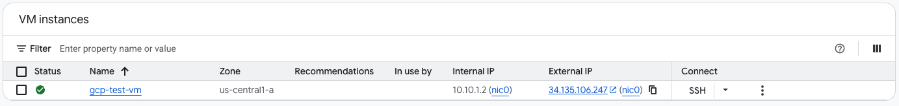

## Verification

Confirm that:

- The instance is running.
- The VM received a private IP within `10.10.1.0/24`.
- SSH access is available.

---

# 2.3 Configure Google Cloud Firewall Rules

## Objective

Allow administrative access and network validation traffic to reach the Google Cloud VM.

## Why This Matters

Firewall rules control inbound traffic to Compute Engine instances. Without these rules, later validation steps—including SSH access and ICMP testing—would fail regardless of whether the VPN is functioning correctly.

## Firewall Rules

| Name | Protocol | Port | Source | Target Tag |
|------|----------|------|--------|------------|
| `allow-ssh` | TCP | 22 | `0.0.0.0/0` | `ssh-access` |
| `allow-icmp` | ICMP | All | `0.0.0.0/0` | `icmp-access` |
| `allow-http` | TCP | 80 | `0.0.0.0/0` | `http-access` |

Assign the following network tags to the VM:

```text
ssh-access
icmp-access
http-access
```

## Verification

Verify that:

- All firewall rules have been created.
- The VM has the correct network tags.
- SSH connectivity succeeds.
- ICMP traffic is permitted.

---

# 2.4 Create the Cloud Router

## Objective

Deploy the Google Cloud Router that will establish Border Gateway Protocol (BGP) sessions with AWS.

## Why This Matters

The Cloud Router forms the control plane of the hybrid network. It exchanges routes dynamically with AWS but does **not** encrypt traffic.

This distinction is important:

- **IPsec** secures traffic.
- **BGP** determines where traffic should be forwarded.

Without the Cloud Router, Google Cloud would have no mechanism for learning AWS routes dynamically.

## Configuration

| Setting | Value |
|----------|-------|
| Name | `gcp-cloud-router` |
| Network | `gcp-production-vpc` |
| Region | `us-central1` |
| ASN | `64514` |
| BGP Identifier | Automatic |
| Keepalive | Default |

### Screenshot


## Verification

Confirm that:

- The Cloud Router exists.
- It is associated with `gcp-production-vpc`.
- ASN `64514` is configured.

---

# 2.5 Create the Google Cloud HA VPN Gateway

## Objective

Create the Google Cloud HA VPN Gateway that will terminate the Google Cloud side of the IPsec tunnels.

## Why This Matters

The HA VPN Gateway provides Google Cloud's encrypted VPN endpoints.

Unlike AWS Site-to-Site VPN, which creates two tunnels per VPN connection, Google Cloud creates a gateway with **two physical interfaces**. Those interfaces will later connect to four AWS tunnel endpoints, resulting in four redundant IPsec tunnels.

## Configuration

| Setting | Value |
|----------|-------|
| Name | `gcp-ha-vpn` |
| Network | `gcp-production-vpc` |
| Region | `us-central1` |
| IP Version | IPv4 |
| Stack Type | IPv4 (Single Stack) |

After creation, Google Cloud automatically assigns two public interface addresses.

| Interface | Public IP |
|-----------|-----------|
| Interface 0 | `34.157.96.55` |
| Interface 1 | `35.220.94.185` |

### Screenshot

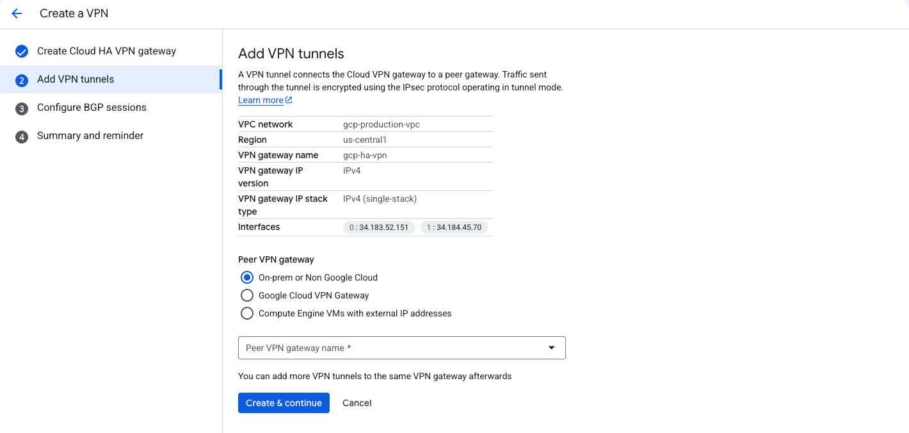

## Verification

Before leaving Google Cloud, verify that:

- The HA VPN Gateway exists.
- Both public interface IPs have been assigned.
- The interface IPs have been recorded accurately.

> **Critical Deployment Note**
>
> This is the point where the workflow intentionally pauses.
>
> The two HA VPN interface IP addresses become the public endpoints for the AWS Customer Gateways. Record these addresses before switching to the AWS Console. Incorrect or missing interface IPs will prevent the VPN tunnels from establishing successfully.

---

## Phase II Summary

At this point, the Google Cloud environment is fully prepared for the AWS deployment.

The following resources should now exist:

- ✓ Custom VPC
- ✓ Custom Subnet
- ✓ Google Cloud Test VM
- ✓ Firewall Rules
- ✓ Cloud Router
- ✓ HA VPN Gateway
- ✓ Two Public HA VPN Interface Addresses

With the Google Cloud infrastructure complete, the deployment can now shift to AWS to build the complementary networking components.

---

# Phase III — AWS Infrastructure

With the Google Cloud environment in place, the deployment now shifts to Amazon Web Services (AWS). The objective of this phase is to build the AWS networking components that will participate in the hybrid cloud connection.

Unlike the Google Cloud deployment, several AWS resources depend on information generated during the previous phase. In particular, the public interface IP addresses assigned to the Google Cloud HA VPN Gateway will later be used when creating the AWS Customer Gateways.

---

# 3.1 Create the AWS VPC

## Objective

Create the AWS Virtual Private Cloud (VPC) that will host the AWS networking resources and EC2 instance used throughout this deployment.

## Why This Matters

The VPC defines AWS's private network boundary and serves as the counterpart to the Google Cloud VPC. All AWS networking resources—including the subnet, Virtual Private Gateway, EC2 instance, and VPN connections—will reside within this network.

## Configuration

| Setting | Value |
|----------|-------|
| Name | `aws-production-vpc` |
| CIDR | `10.20.0.0/16` |
| Tenancy | Default |
| Region | `us-east-1` |

### Screenshot

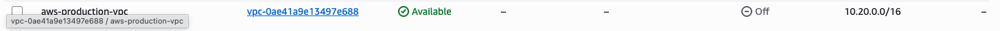

## Verification

Verify that:

- The VPC has been created successfully.
- The CIDR block is `10.20.0.0/16`.
- No CIDR overlap exists with the Google Cloud network.

---

# 3.2 Create the AWS Subnet

## Objective

Create the subnet that will host the EC2 instance used for connectivity testing.

## Why This Matters

The subnet provides Layer 3 connectivity for workloads within the AWS VPC. The EC2 instance launched later in this phase will use this subnet as its private network.

## Configuration

| Setting | Value |
|----------|-------|
| Name | `aws-production-subnet` |
| VPC | `aws-production-vpc` |
| CIDR | `10.20.1.0/24` |
| Availability Zone | `us-east-1a` (or any available AZ in `us-east-1`) |

### Screenshot

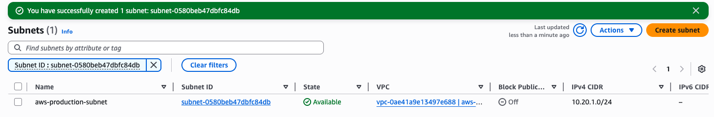

## Verification

Confirm that:

- The subnet exists within `aws-production-vpc`.
- The subnet CIDR is `10.20.1.0/24`.
- The subnet is associated with the VPC's main route table.

---

# 3.3 Create and Attach the Internet Gateway

## Objective

Provide internet connectivity for administrative access to the EC2 instance.

## Why This Matters

The Internet Gateway allows inbound SSH access and outbound internet connectivity for the EC2 instance. It is **not** used for traffic traversing the VPN. Once the VPN is established, private traffic between AWS and Google Cloud will flow through the Virtual Private Gateway rather than the Internet Gateway.

## Configuration

| Setting | Value |
|----------|-------|
| Name | `aws-production-igw` |
| Attach To | `aws-production-vpc` |

### Screenshot

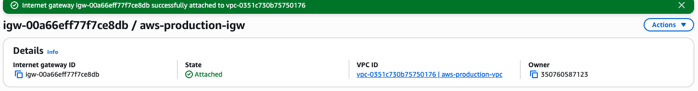

## Verification

Confirm that:

- The Internet Gateway has been created.
- It is attached to `aws-production-vpc`.

---

# 3.4 Configure the Main Route Table

## Objective

Configure the VPC's main route table to provide internet connectivity for the subnet.

## Why This Matters

AWS automatically creates a main route table for every VPC. For this deployment, the main route table is sufficient because only a single subnet is being used.

During validation, no custom route table was required. Dynamic routes learned later through BGP will be installed automatically after route propagation is enabled.

## Required Routes

| Destination | Target |
|-------------|--------|
| `10.20.0.0/16` | `local` |
| `0.0.0.0/0` | `aws-production-igw` |

> **Production Note**
>
> Do **not** manually add a route to the Google Cloud network at this stage. That route will be learned dynamically through BGP and installed automatically after Virtual Private Gateway route propagation is enabled in Phase V.

## Verification

Verify that:

- The subnet is associated with the main route table.
- Internet-bound traffic (`0.0.0.0/0`) points to the Internet Gateway.
- The local VPC route remains present.

---

# 3.5 Launch the AWS EC2 Test Instance

## Objective

Deploy the EC2 instance that will serve as the AWS endpoint for end-to-end connectivity testing.

## Why This Matters

This instance is the AWS counterpart to the Google Cloud test VM. After the VPN is established, the two systems will communicate using private IP addresses to verify that IPsec encryption, BGP route exchange, firewall rules, and routing have all been configured correctly.

## Configuration

| Setting | Value |
|----------|-------|
| Name | `aws-test-ec2` |
| AMI | Amazon Linux 2023 |
| Instance Type | `t3.micro` (or smallest available) |
| VPC | `aws-production-vpc` |
| Subnet | `aws-production-subnet` |
| Auto-assign Public IP | Enabled |
| Private IP | `10.20.1.34` |
| Public IP | `98.93.191.7` |

### Security Group

| Rule | Configuration | Purpose |
|------|---------------|---------|
| SSH | TCP 22 from `0.0.0.0/0` | Remote administration |
| ICMP | All ICMP IPv4 | End-to-end connectivity validation |
| HTTP | TCP 80 from `0.0.0.0/0` | Optional web server testing |

### Screenshot

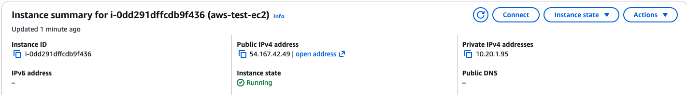

## Verification

Confirm that:

- The EC2 instance is running.
- It has received the expected private IP address.
- SSH connectivity is successful.
- Security group rules have been applied correctly.

---

## Phase III Summary

At this point, the AWS environment is fully prepared for VPN deployment.

The following resources should now exist:

- ✓ AWS VPC
- ✓ AWS Subnet
- ✓ Internet Gateway
- ✓ Main Route Table
- ✓ EC2 Test Instance
- ✓ Security Group

Both cloud environments have now been provisioned independently.

The next phase connects these environments by creating the AWS Site-to-Site VPN connections, Google Cloud VPN tunnels, and the dynamic BGP relationships that allow both networks to exchange routes securely.
---

# Phase IV — VPN Construction

This phase establishes the encrypted communication path between Google Cloud Platform (GCP) and Amazon Web Services (AWS). At this point, both cloud environments have been deployed independently. The remaining objective is to securely connect them using IPsec VPN tunnels before configuring dynamic route exchange with Border Gateway Protocol (BGP).

The completed VPN architecture consists of:

- Two Google Cloud HA VPN interfaces
- Two AWS Customer Gateways
- One AWS Virtual Private Gateway
- Two AWS Site-to-Site VPN connections
- Four redundant IPsec tunnels

The VPN infrastructure created in this phase forms the encrypted transport layer between both cloud providers. Dynamic routing will be configured in the next phase.

---

## VPN Topology

```text
                    Google Cloud                           AWS

             HA VPN Interface 0
             34.157.96.55
                    │
        ┌───────────┴───────────┐
        │                       │
Tunnel 1│                       │Tunnel 2
        ▼                       ▼
 VPN Connection 1         VPN Connection 1

             HA VPN Interface 1
             35.220.94.185
                    │
        ┌───────────┴───────────┐
        │                       │
Tunnel 3│                       │Tunnel 4
        ▼                       ▼
 VPN Connection 2         VPN Connection 2
```

This mapping is important because Google Cloud HA VPN exposes **two local interfaces**, while AWS creates **two VPN tunnels for every Site-to-Site VPN connection**. Two AWS VPN connections therefore produce four tunnel endpoints that must be represented within Google Cloud.

---

# 4.1 Create AWS Customer Gateways

## Objective

Create AWS Customer Gateway resources that represent the two public interfaces of the Google Cloud HA VPN Gateway.

## Why This Matters

A Customer Gateway represents the remote VPN device from AWS's perspective. Since the Google Cloud HA VPN Gateway exposes two public interfaces, AWS requires two Customer Gateway resources—one for each interface.

## Customer Gateway 1

| Setting | Value |
|----------|-------|
| Name | `gcp-cgw-1` |
| BGP ASN | `64514` |
| Public IP Address | `34.157.96.55` |
| Customer Gateway ID | `cgw-0a8542b67c4fdfaac` |

## Customer Gateway 2

| Setting | Value |
|----------|-------|
| Name | `gcp-cgw-2` |
| BGP ASN | `64514` |
| Public IP Address | `35.220.94.185` |
| Customer Gateway ID | `cgw-0cf12083ed3f56f4f` |

### Screenshots

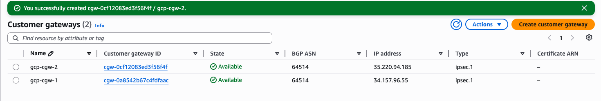

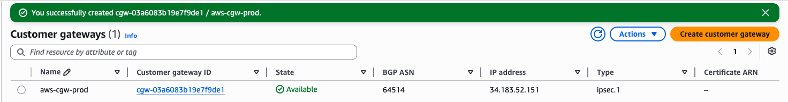

## Verification

Verify that:

- Both Customer Gateways exist.
- Each Customer Gateway references the correct Google Cloud HA VPN interface.
- Both Customer Gateways use ASN `64514`.

---

# 4.2 Create and Attach the AWS Virtual Private Gateway

## Objective

Create the AWS Virtual Private Gateway (VGW) and attach it to the AWS VPC.

## Why This Matters

The Virtual Private Gateway serves as AWS's VPN endpoint. It terminates the AWS side of every VPN tunnel and exchanges routes with Google Cloud through BGP.

It is important to distinguish the two AWS gateway types:

```text
Customer Gateway
    =
Remote VPN endpoint (Google Cloud)

Virtual Private Gateway
    =
AWS VPN endpoint
```

## Configuration

| Setting | Value |
|----------|-------|
| Name | `aws-vgw-prod` |
| ASN | `65001` |
| ID | `vgw-0523ead2f9f64188c` |
| Attached VPC | `aws-production-vpc` |

### Screenshots

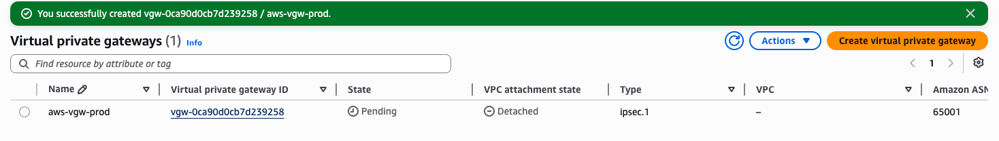

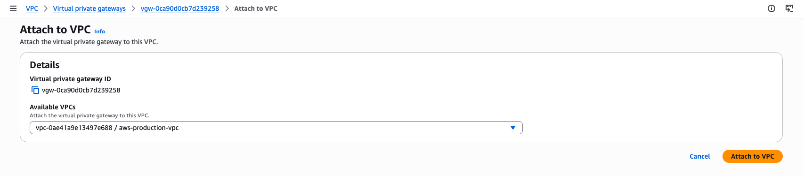

## Verification

Verify that:

- The Virtual Private Gateway has been created.
- It is attached to `aws-production-vpc`.
- ASN `65001` is configured.

---

# 4.3 Create the AWS Site-to-Site VPN Connections

## Objective

Create two AWS Site-to-Site VPN connections that terminate on the Virtual Private Gateway.

## Why This Matters

Each AWS Site-to-Site VPN connection automatically creates two redundant IPsec tunnels. Because two Customer Gateways were created, two VPN connections are required, producing four total VPN tunnels.

### VPN Connection 1

| Setting | Value |
|----------|-------|
| Name | `gcp-aws-vpn-1` |
| VPN ID | `vpn-01628f55a1845e091` |
| Virtual Private Gateway | `vgw-0523ead2f9f64188c` |
| Customer Gateway | `gcp-cgw-1` |
| Routing | Dynamic (BGP) |
| Local Network CIDR | `0.0.0.0/0` |
| Remote Network CIDR | `0.0.0.0/0` |

| Tunnel | Outside IP | Inside CIDR | Pre-Shared Key |
|----------|------------|-------------|----------------|
| Tunnel 1 | `3.209.244.255` | `169.254.12.0/30` | `hW8QJ4Q1lpzmF51JkEgPWp1zPVUXbrkUd04dzMbtdIJPyaS0zp7d48bnyFRj6i6y` |
| Tunnel 2 | `100.58.87.224` | `169.254.13.0/30` | `NTaaiH0J1ghfJYjHxIKKt9xzP7FVh0sIQ1xvE5wY4iiqcXvccopRHw3fdHb6ai5B` |

### VPN Connection 2

| Setting | Value |
|----------|-------|
| Name | `gcp-aws-vpn-2` |
| VPN ID | `vpn-03386a397abbdf8d5` |
| Virtual Private Gateway | `vgw-0523ead2f9f64188c` |
| Customer Gateway | `gcp-cgw-2` |
| Routing | Dynamic (BGP) |

| Tunnel | Outside IP | Inside CIDR | Pre-Shared Key |
|----------|------------|-------------|----------------|
| Tunnel 3 | `3.211.125.224` | `169.254.14.0/30` | `7ZsUlmw5u2zL0aikoEHdDRh1Lsjx0pktBIlSzLtRgGerVzIZAFDO5y21CwyjZyzs` |
| Tunnel 4 | `54.235.248.162` | `169.254.15.0/30` | `FvMDtE18RbeZDlzKbljTanKF79ZMaGaCP6RgYWMz8O4im28lkoBKoGveAgrwgCQa` |

> **Production Note**
>
> Record every pre-shared key immediately after creating the VPN connections. Google Cloud requires these exact values when creating the corresponding VPN tunnels. AWS does not allow the keys to be retrieved later without editing the tunnel configuration.

### Screenshot


## Verification

Verify that:

- Both VPN connections exist.
- Four AWS tunnel outside IP addresses have been generated.
- All four pre-shared keys have been recorded.

---

# 4.4 Create the Google Cloud External Peer VPN Gateway

## Objective

Create the Google Cloud External Peer VPN Gateway that represents the AWS VPN endpoints.

## Why This Matters

This is one of the most important concepts in the deployment.

Although the Google Cloud HA VPN Gateway has only **two local interfaces**, AWS generates **four tunnel outside IP addresses** across two Site-to-Site VPN connections.

The External Peer VPN Gateway bridges this difference by representing all four AWS tunnel endpoints inside Google Cloud.

## Configuration

| Peer Interface | AWS Tunnel | Outside IP |
|----------------|------------|------------|
| Interface 0 | VPN Connection 1 – Tunnel 1 | `3.209.244.255` |
| Interface 1 | VPN Connection 1 – Tunnel 2 | `100.58.87.224` |
| Interface 2 | VPN Connection 2 – Tunnel 1 | `3.211.125.224` |
| Interface 3 | VPN Connection 2 – Tunnel 2 | `54.235.248.162` |

## Verification

Verify that:

- Four peer interfaces have been created.
- Every AWS tunnel outside IP has been entered correctly.

---

# 4.5 Create the Four Google Cloud VPN Tunnels

## Objective

Create the four IPsec tunnels connecting Google Cloud to AWS.

## Tunnel Mapping

| Google Cloud Tunnel | GCP Interface | AWS Peer Interface | AWS Outside IP |
|---------------------|---------------|--------------------|----------------|
| `gcp-aws-tunnel-1` | Interface 0 | Interface 0 | `3.209.244.255` |
| `gcp-aws-tunnel-2` | Interface 0 | Interface 1 | `100.58.87.224` |
| `gcp-aws-tunnel-3` | Interface 1 | Interface 2 | `3.211.125.224` |
| `gcp-aws-tunnel-4` | Interface 1 | Interface 3 | `54.235.248.162` |

## VPN Cipher Configuration

Configure each tunnel using the following cryptographic parameters.

| Phase | Encryption | Integrity | Diffie-Hellman / PFS |
|--------|------------|-----------|----------------------|
| IKE Phase 1 | AES-CBC-256 | HMAC-SHA2-256-128 | Group 14 |
| IKE Phase 2 | AES-CBC-256 | HMAC-SHA2-256-128 | Group 14 |

> **Key Concept**
>
> IPsec and BGP serve different purposes.
>
> - **IPsec** creates the encrypted transport path.
> - **BGP** exchanges routing information across that encrypted path.
>
> At the end of this phase, the encrypted transport exists, but routing has not yet been configured.

## Verification

Confirm that:

- Four Google Cloud VPN tunnels have been created.
- Every tunnel references the correct peer interface.
- Every tunnel uses the correct pre-shared key.
- Encryption parameters match the AWS configuration.

---

## Phase IV Summary

At this point:

- ✓ Two AWS Customer Gateways have been created.
- ✓ One AWS Virtual Private Gateway has been attached.
- ✓ Two AWS Site-to-Site VPN connections exist.
- ✓ One Google Cloud External Peer VPN Gateway has been created.
- ✓ Four Google Cloud VPN tunnels have been configured.
- ✓ IPsec tunnel negotiation can now begin.

Although encrypted connectivity now exists, neither cloud provider has exchanged routes. The next phase establishes four BGP sessions, enabling dynamic route exchange and completing the hybrid cloud connection.

---

# Phase V — BGP and Dynamic Routing

With the IPsec tunnels established, the encrypted transport path between Google Cloud and AWS is now complete. However, encrypted tunnels alone do not allow traffic to flow between networks.

This phase establishes the dynamic routing control plane by configuring Border Gateway Protocol (BGP) over each VPN tunnel. Once BGP sessions are established, both cloud providers automatically exchange routes, allowing workloads to communicate using private IP addresses.

---

## 5.1 Configure the Four BGP Sessions

### Objective

Configure one BGP session for each VPN tunnel to enable dynamic route exchange between Google Cloud and AWS.

### Why This Matters

IPsec and BGP perform two different functions within the VPN architecture.

- **IPsec** encrypts and protects network traffic.
- **BGP** advertises network routes across the encrypted tunnels.

A VPN tunnel may report **Established** while traffic still fails if BGP sessions are not exchanging routes.

### Validated BGP Configuration

Configure the following BGP sessions on the Google Cloud Cloud Router.

| BGP Session | Google Cloud Router IP | AWS Peer IP | Peer ASN |
|--------------|------------------------|-------------|-----------|
| `bgp-tunnel-1` | `169.254.12.2` | `169.254.12.1` | `65001` |
| `bgp-tunnel-2` | `169.254.13.2` | `169.254.13.1` | `65001` |
| `bgp-tunnel-3` | `169.254.14.2` | `169.254.14.1` | `65001` |
| `bgp-tunnel-4` | `169.254.15.2` | `169.254.15.1` | `65001` |

> **Critical Deployment Lesson**
>
> During the initial deployment, the BGP addresses were assigned incorrectly by giving Google Cloud the first usable address (`.1`) and AWS the second (`.2`). Although all four IPsec tunnels established successfully, every BGP session remained down.
>
> Reversing the assignment so that AWS used the first usable address (`.1`) and Google Cloud used the second (`.2`) immediately established all four BGP sessions.

### Screenshot


### Verification

Verify that:

- All four BGP sessions show **Established**.
- Every session peers with ASN `65001`.
- Each session is bound to the correct VPN tunnel.
- No BGP neighbor reports a Down or Idle state.

---

## 5.2 Verify Route Exchange

### Objective

Confirm that both cloud providers are successfully exchanging routes through BGP.

### Google Cloud Verification

Navigate to:

```text
Google Cloud Console
→ Hybrid Connectivity
→ Cloud Routers
→ gcp-cloud-router
→ Advertised and Learned Routes
```

The Cloud Router should learn the AWS VPC network:

| Learned Route | Learned From |
|---------------|--------------|
| `10.20.0.0/16` | AWS Virtual Private Gateway |

### Why This Matters

A learned route confirms that the BGP control plane is functioning correctly and that AWS is successfully advertising its network to Google Cloud.

---

## 5.3 Enable AWS Route Propagation

### Objective

Allow routes learned through the AWS Virtual Private Gateway to be automatically installed into the VPC route table.

### Why This Matters

Although BGP may be fully established, AWS will not install learned routes into the VPC route table until route propagation is enabled.

Without this step:

- IPsec tunnels are established.
- BGP sessions are established.
- Google Cloud learns AWS routes.
- AWS does **not** install Google Cloud routes.
- End-to-end connectivity fails.

### Procedure

Navigate to:

```text
AWS Console
→ VPC
→ Route Tables
→ Main Route Table
→ Route Propagation
```

Select **Edit Route Propagation** and enable propagation for:

```text
aws-vgw-prod
```

### Expected Route

After enabling propagation, the AWS main route table should automatically install the Google Cloud route.

| Destination | Target | Propagated |
|-------------|--------|------------|
| `10.10.1.0/24` | `vgw-0523ead2f9f64188c` | Yes |

### Verification

Confirm that:

- Route propagation is enabled.
- The Google Cloud subnet appears as a propagated route.
- The route target is the Virtual Private Gateway.
- The propagated status displays **Yes**.

---

## 5.4 Verify Tunnel and Routing Health

At the completion of this phase, verify the following conditions before performing end-to-end testing.

| Component | Expected Status |
|-----------|-----------------|
| IPsec Tunnel 1 | Established |
| IPsec Tunnel 2 | Established |
| IPsec Tunnel 3 | Established |
| IPsec Tunnel 4 | Established |
| BGP Session 1 | Established |
| BGP Session 2 | Established |
| BGP Session 3 | Established |
| BGP Session 4 | Established |
| Google Cloud Learned Routes | Present |
| AWS Propagated Routes | Present |

### Screenshot


---

## Phase V Summary

At this point, the hybrid cloud control plane is fully operational.

The following conditions should now be true:

- ✓ Four IPsec tunnels are established.
- ✓ Four BGP sessions are established.
- ✓ Google Cloud has learned the AWS network.
- ✓ AWS has installed the Google Cloud route through route propagation.
- ✓ Dynamic routing is functioning across both cloud providers.

The infrastructure is now ready for end-to-end connectivity testing using private IP addresses.

---

# Phase VI — Validation

The final phase of the deployment verifies that every component of the hybrid cloud architecture is functioning correctly. Validation should be performed in layers, beginning with the encrypted transport layer and ending with end-to-end application connectivity.

Following this sequence allows failures to be isolated quickly and reduces unnecessary troubleshooting.

The recommended validation order is:

1. Verify IPsec tunnel establishment.
2. Verify BGP session establishment.
3. Verify route exchange.
4. Verify AWS route propagation.
5. Verify end-to-end connectivity.

---

# 6.1 Verify IPsec Tunnel Status

## Objective

Confirm that all encrypted VPN tunnels have successfully established between Google Cloud and AWS.

## Why This Matters

IPsec provides the encrypted transport path between both cloud providers. If the tunnels are not established, BGP cannot exchange routes and no private communication will occur.

### Google Cloud

Navigate to:

```text
Google Cloud Console
→ Hybrid Connectivity
→ Cloud VPN
→ VPN Tunnels
```

All four tunnels should display:

```text
Established
```

### AWS

Navigate to:

```text
AWS Console
→ VPC
→ Site-to-Site VPN Connections
```

Each tunnel should report:

```text
IPSEC IS UP
```

### Screenshots

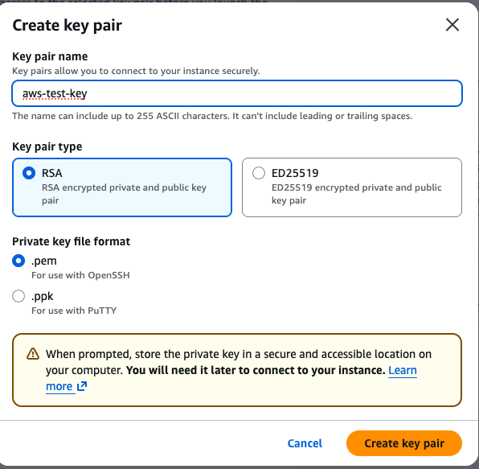


### Verification

Confirm that:

- All four Google Cloud VPN tunnels are established.
- Both AWS Site-to-Site VPN connections report healthy IPsec tunnels.
- No tunnel reports a Down or Negotiating state.

---

# 6.2 Verify BGP Sessions

## Objective

Confirm that all BGP sessions have successfully established across the VPN tunnels.

## Why This Matters

While IPsec secures the connection, BGP provides the routing intelligence that allows both cloud providers to exchange network reachability information.

Navigate to:

```text
Google Cloud Console
→ Hybrid Connectivity
→ Cloud Routers
→ gcp-cloud-router
→ BGP Sessions
```

### Expected Result

All four BGP sessions should display:

```text
Established
```

### Screenshot

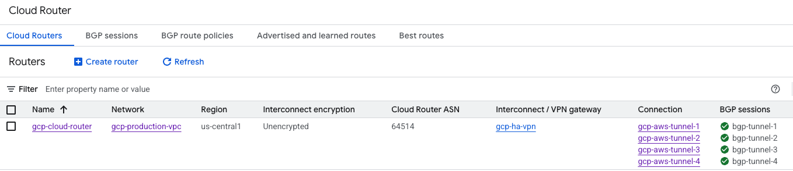

### Verification

Confirm that:

- Four BGP sessions are established.
- All peers use ASN `65001`.
- No session is in the Idle, Connect, or Active state.

---

# 6.3 Verify Learned Routes in Google Cloud

## Objective

Confirm that Google Cloud has successfully learned the AWS network through BGP.

## Why This Matters

A learned route demonstrates that AWS is advertising its network and that the BGP control plane is functioning correctly.

Navigate to:

```text
Google Cloud Console
→ Cloud Router
→ Advertised and Learned Routes
```

### Expected Learned Route

```text
10.20.0.0/16
```

This route should appear as a learned route from AWS ASN `65001`.

### Verification

Confirm that:

- The AWS VPC network appears in the learned routes.
- The route is associated with the appropriate BGP session.

---

# 6.4 Verify AWS Route Propagation

## Objective

Confirm that AWS has installed the Google Cloud network into the VPC route table through Virtual Private Gateway route propagation.

## Why This Matters

Even with fully established BGP sessions, AWS workloads cannot reach Google Cloud unless the learned route has been propagated into the VPC route table.

Navigate to:

```text
AWS Console
→ VPC
→ Route Tables
→ Main Route Table
```

### Expected Route

```text
10.10.1.0/24 → vgw-0523ead2f9f64188c
```

### Verification

Confirm that:

- The route exists.
- The target is the Virtual Private Gateway.
- The route is marked as **Propagated**.

---

# 6.5 Verify End-to-End Connectivity

## Objective

Verify successful communication between workloads using private IP addresses.

## Why This Matters

This test validates the complete hybrid cloud architecture, including:

- IPsec encryption
- Dynamic routing with BGP
- Route propagation
- Firewall configuration
- Security group configuration
- End-to-end packet forwarding

### From the Google Cloud VM

```bash
ping 10.20.1.34
```

### Expected Result

The AWS EC2 instance responds successfully.

---

### From the AWS EC2 Instance

```bash
ping 10.10.1.2
```

### Expected Result

The Google Cloud VM responds successfully.

### Screenshot


---

# Validation Summary

The deployment is considered successful when all of the following conditions are true.

| Validation Check | Expected Result |
|------------------|-----------------|
| Four IPsec tunnels | Established |
| Four BGP sessions | Established |
| Google Cloud learned routes | Present |
| AWS propagated routes | Present |
| GCP → AWS private ping | Successful |
| AWS → GCP private ping | Successful |

## Final Result

All validation checks completed successfully.

This confirms that:

- ✓ IPsec encryption is operational.
- ✓ Dynamic routing through BGP is functioning correctly.
- ✓ Google Cloud and AWS are exchanging routes successfully.
- ✓ AWS route propagation is correctly configured.
- ✓ Firewall rules and security groups permit required traffic.
- ✓ Both cloud providers communicate securely over private IP space.
- ✓ The hybrid cloud deployment is fully operational.

---

# Phase VII — Cleanup and Cost Management

After successfully validating the hybrid cloud deployment, remove all resources to prevent unnecessary cloud charges.

Both Google Cloud and AWS enforce resource dependencies. Deleting resources in the wrong order will result in dependency errors. Follow the cleanup sequence below to ensure every resource can be removed successfully.

---

# 7.1 Google Cloud Cleanup

## Objective

Safely remove all Google Cloud networking resources in dependency order.

## Cleanup Order

Delete the following resources in the order shown.

```text
1. VPN Tunnels
2. External Peer VPN Gateway
3. HA VPN Gateway
4. Cloud Router
5. Compute Engine VM
6. Firewall Rules
7. Subnet
8. VPC
```

### Resources

```text
gcp-aws-tunnel-1
gcp-aws-tunnel-2
gcp-aws-tunnel-3
gcp-aws-tunnel-4

aws-peer-vpn-gateway

gcp-ha-vpn

gcp-cloud-router

gcp-test-vm

allow-ssh
allow-icmp
allow-http

gcp-production-subnet

gcp-production-vpc
```

### Verification

Confirm that:

- No VPN resources remain.
- The Cloud Router has been deleted.
- The VPC contains no subnets or firewall rules.
- The project no longer contains billable networking resources related to this deployment.

---

# 7.2 AWS Cleanup

## Objective

Safely remove all AWS networking resources while respecting AWS resource dependencies.

## Cleanup Order

Delete the following resources in the order shown.

```text
1. VPN Connections
2. Customer Gateways
3. Detach Virtual Private Gateway
4. Delete Virtual Private Gateway
5. Terminate EC2 Instance
6. Delete Security Group
7. Detach and Delete Internet Gateway
8. Delete Subnet
9. Delete VPC
```

### Resources

```text
gcp-aws-vpn-1

gcp-aws-vpn-2

gcp-cgw-1

gcp-cgw-2

aws-vgw-prod

aws-test-ec2

aws-test-sg

aws-production-igw

aws-production-subnet

aws-production-vpc
```

### Verification

Confirm that:

- All VPN resources have been removed.
- The Virtual Private Gateway is detached and deleted.
- The EC2 instance has been terminated.
- The VPC no longer contains subnets or gateways.
- No billable networking resources remain.

---

# Troubleshooting Guide

This section summarizes the most common issues encountered during the deployment and the validated solutions used to resolve them.

---

## Problem: IPsec Tunnel Is Down

### Symptoms

- Tunnel status reports **Down**.
- AWS displays **IPSEC IS DOWN**.
- Google Cloud VPN tunnel never establishes.

### Possible Causes

- Incorrect peer public IP address
- Incorrect pre-shared key
- IKE version mismatch
- Encryption or integrity proposal mismatch
- Incorrect tunnel mapping
- Customer Gateway configured with the wrong Google Cloud interface address

### Recommended Checks

- Verify the HA VPN interface IPs.
- Verify every AWS tunnel outside IP.
- Verify every pre-shared key.
- Confirm both cloud providers use IKEv2.
- Confirm encryption proposals match.

---

## Problem: IPsec Is Established but BGP Is Down

### Symptoms

- VPN tunnel reports **Established**.
- Cloud Router reports **BGP Down**.
- No learned routes appear.

### Possible Causes

- Incorrect BGP peer IP assignment
- Incorrect peer ASN
- Incorrect `/30` tunnel network
- Disabled BGP peer
- MD5 authentication mismatch

### Validated Resolution

The working deployment used the following BGP assignment:

```text
AWS Virtual Private Gateway = First usable address (.1)

Google Cloud Cloud Router = Second usable address (.2)
```

Reversing these assignments prevented all four BGP sessions from establishing even though every IPsec tunnel was operational.

---

## Problem: BGP Is Established but End-to-End Connectivity Fails

### Symptoms

- All VPN tunnels are established.
- All BGP sessions are established.
- Private ping requests fail.

### Recommended Checks

Verify:

- Google Cloud learned routes
- AWS propagated routes
- AWS route table entries
- Google Cloud firewall rules
- AWS security group rules
- Linux host firewall configuration
- Correct private IP addresses

---

## Problem: AWS Does Not Learn the Google Cloud Network

### Symptoms

Google Cloud successfully learns the AWS VPC network, but AWS does not install the Google Cloud subnet into its route table.

### Recommended Checks

Navigate to:

```text
AWS Console
→ VPC
→ Route Tables
→ Main Route Table
→ Route Propagation
```

Confirm that route propagation is enabled for:

```text
aws-vgw-prod
```

The route table should automatically install:

```text
10.10.1.0/24 → Virtual Private Gateway
```

---

## Problem: Learned Routes Are Missing in Google Cloud

### Symptoms

BGP appears unhealthy or no AWS routes are visible.

### Recommended Checks

Navigate to:

```text
Google Cloud Console
→ Cloud Router
→ Advertised and Learned Routes
```

Verify that:

```text
10.20.0.0/16
```

appears as a learned route from AWS ASN `65001`.

---

# Final Outcome

The deployment successfully achieved the following objectives:

- ✓ Deployed independent Google Cloud and AWS virtual networks.
- ✓ Established four redundant IPsec VPN tunnels.
- ✓ Configured dynamic routing with Border Gateway Protocol (BGP).
- ✓ Exchanged routes automatically between cloud providers.
- ✓ Enabled AWS route propagation.
- ✓ Validated secure, private communication between workloads.
- ✓ Removed cloud resources using dependency-aware cleanup procedures.

This project demonstrates the implementation of a production-style hybrid cloud VPN architecture using Google Cloud HA VPN, AWS Site-to-Site VPN, IPsec encryption, and dynamic routing with BGP.

---

# Architectural Discussion Points

The following questions reinforce the architectural concepts demonstrated throughout this deployment. They can be used as a self-review, knowledge check, or discussion guide when explaining the solution to other engineers.

---

## Why use Google Cloud HA VPN instead of Classic VPN?

Google Cloud HA VPN provides two independent gateway interfaces and supports a highly available architecture when deployed with redundant tunnels. When properly configured, it offers a 99.99% service availability SLA and supports dynamic routing with BGP through Cloud Router.

---

## Why are there four VPN tunnels?

Google Cloud HA VPN exposes two public interfaces.

Each AWS Site-to-Site VPN connection automatically creates two IPsec tunnels.

Creating two AWS VPN connections—one for each Google Cloud HA VPN interface—results in four redundant VPN tunnels that provide fault tolerance and increased availability.

---

## What is the role of the Cloud Router?

The Cloud Router is responsible for the dynamic routing control plane.

It establishes BGP sessions with AWS, exchanges network reachability information, and automatically updates routes as the network changes.

The Cloud Router does **not** encrypt traffic.

---

## What is the role of IPsec?

IPsec provides the encrypted transport path between Google Cloud and AWS.

It authenticates the VPN peers, negotiates encryption parameters using IKEv2, encrypts packets traversing the tunnel, and ensures data confidentiality and integrity while traffic crosses the public internet.

---

## Why did BGP initially fail even though IPsec was established?

The initial deployment assigned the BGP peer addresses incorrectly.

Although IPsec successfully established the encrypted tunnels, the Google Cloud Cloud Router and the AWS Virtual Private Gateway were using opposite BGP peer addresses.

The validated deployment assigned:

```text
AWS Virtual Private Gateway = First usable address (.1)

Google Cloud Cloud Router = Second usable address (.2)
```

Once the peer addresses were corrected, all four BGP sessions established successfully.

---

## Why was AWS route propagation required?

After BGP was established, AWS successfully learned the Google Cloud network but did not automatically install the learned route into the VPC route table.

Enabling Virtual Private Gateway route propagation allowed AWS to automatically install:

```text
10.10.1.0/24 → Virtual Private Gateway
```

Without route propagation, end-to-end connectivity was not possible despite healthy IPsec tunnels and BGP sessions.

---

## Why use dynamic routing instead of static routes?

Dynamic routing with BGP allows both cloud providers to automatically exchange network reachability information.

Compared to static routing, BGP:

- Automatically advertises new networks.
- Adapts to topology changes.
- Reduces manual route management.
- Supports highly available VPN architectures.

---

## Why separate the transport plane from the control plane?

This deployment demonstrates an important networking principle:

- **IPsec** provides the encrypted transport plane.
- **BGP** provides the routing control plane.

Because these functions are independent, an IPsec tunnel can be fully established while traffic still fails if BGP has not successfully exchanged routes.

Understanding this distinction is essential when troubleshooting hybrid cloud VPN deployments.

---

# Final Deployment Result

The deployment concluded with the following validated state:

```text
✓ Four IPsec tunnels established

✓ Four BGP sessions established

✓ Google Cloud learned:
10.20.0.0/16

✓ AWS installed through route propagation:
10.10.1.0/24

✓ Google Cloud VM successfully reached the AWS EC2 instance

✓ AWS EC2 successfully reached the Google Cloud VM

✓ End-to-end communication occurred entirely over private IP addresses
```

This confirms the successful deployment of a production-style hybrid cloud network using Google Cloud HA VPN, AWS Site-to-Site VPN, IPsec encryption, and dynamic routing with Border Gateway Protocol (BGP).

---

# References

## Google Cloud Documentation

- Google Cloud HA VPN  
  https://cloud.google.com/network-connectivity/docs/vpn/concepts/overview

- Cloud Router Overview  
  https://cloud.google.com/network-connectivity/docs/router/concepts/overview

- Cloud Router BGP Documentation  
  https://cloud.google.com/network-connectivity/docs/router/how-to/configuring-bgp

- External Peer VPN Gateway  
  https://cloud.google.com/network-connectivity/docs/vpn/how-to/creating-ha-vpn2

---

## Amazon Web Services Documentation

- AWS Site-to-Site VPN  
  https://docs.aws.amazon.com/vpn/latest/s2svpn/

- AWS Virtual Private Gateway  
  https://docs.aws.amazon.com/vpn/latest/s2svpn/VPC_VPN.html

- AWS Customer Gateway  
  https://docs.aws.amazon.com/vpn/latest/s2svpn/your-cgw.html

- AWS Route Propagation  
  https://docs.aws.amazon.com/vpc/latest/userguide/RouteTables.html

---

## RFCs

- RFC 4301 — Security Architecture for the Internet Protocol  
  https://www.rfc-editor.org/rfc/rfc4301

- RFC 4303 — IP Encapsulating Security Payload (ESP)  
  https://www.rfc-editor.org/rfc/rfc4303

- RFC 7296 — Internet Key Exchange Protocol Version 2 (IKEv2)  
  https://www.rfc-editor.org/rfc/rfc7296

- RFC 4271 — Border Gateway Protocol 4 (BGP-4)  
  https://www.rfc-editor.org/rfc/rfc4271
